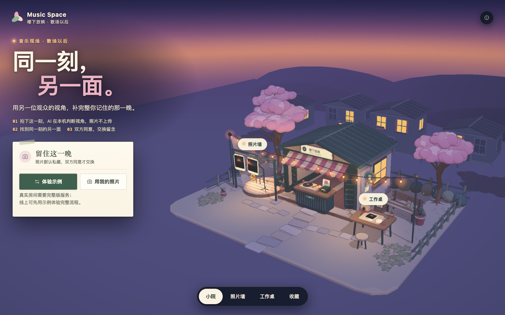

# Music Space · 0.17.0-rc.1 候选发布

最新体验入口是 **/event-room/**：人物换装、同场房间、照片、双方同意的交换、私聊和房主成员管理，使用同源 Node API 与持久 SQLite。旧首页与旧 GitHub Pages 演示保留；本轮不更新 gh-pages，也不表示新房间已公开上线。

源码运行：Node.js 24+，执行 `npm ci`、`npm run build:all`、`npm start`，打开 http://127.0.0.1:8787/event-room/ 。已构建运行包直接 `node server/index.js`，不需要安装依赖。数据保存在 DATA_DIR（默认 data/），重启必须复用该目录。

- [运行说明](RUN-ME.md) · [持久部署、备份与上线边界](docs/deployment.md)
- [本次检查与未测项](docs/release/0.17.0-rc.1.md) · [项目状态](docs/PROJECT_STATUS.md)
- 检查命令：`npm test`、`npm run test:release`、`npm run test:character`、`npm run ai:check`。

以下 0.16 记录保留为旧首页及交付历史；最新状态以本节和上述链接为准。

# Music Space

**同一刻，另一面。演唱会散场以后，同场观众交换彼此没有的视角。**

MVP **0.16.0** · 文档 **3.0** · 2026-09-30 · 在线演示（静态版）：**<https://musicmapteam.github.io/musicSpace/>**



你拍到了舞台，朋友记住了人海。各自留下一张现场卡，向对方申请交换；对方同意后，两张卡合成一张两人署名的双联票根，收进各自的收藏。「同一刻」按照片自带的拍摄时间判断，「另一面」按视角判断；视角由一个在你自己设备上运行的小模型建议，AI 判断时照片不上传。

线上版本以 `gh-pages` 分支为准：2026-09-30 线上是 `main@54f3e6e`（PR #1 的合并提交）的构建（带 `ai/`，部署提交 `e28fab5`），即含 0.16 的全部代码；更早的部署是 `7c962e2` 的 `2d8f1a3` 与没有 AI 的 `a45ecbd` 的 `f0ad219`。详见[状态与待办](#状态与待办)。快速体验：打开线上演示，首页点「体验示例」，切换 Lin 与阿遥完成一次申请与同意，再用「用我的照片」试试 AI（用法见 [RUN-ME.md](RUN-ME.md)）。

## Livehouse 新主线 · 本地开发中

2026-10-01 07:45 UTC：正在完善真实现场产品闭环。快速昵称入场、独立的「这一晚」照片/当前联系回顾及真实下一场入口已实现，240 项相关检查和构建通过，实际浏览器流程尚待验收；局部舞台印刷与整体 UI 候选也待实际审图。完整范围与剩余项见[完成清单](docs/event/COMPLETION.md)。当前新主线仍只本机运行。

2026-10-01 小幅调整：眼镜继续自由选择，默认无镜，已保存外观保留；四方向、取消、保存、双身份同步和重载的真实 GPU 复验通过。随后将单个部件提升为衣橱主入口，组合示例默认折叠；这项新层级只经源码／DOM 与构建检查，未再做浏览器审图。相关测试 80 项通过。见[眼镜可选验证](docs/event/evidence/optional-eyewear-qa.md)。

用户进一步明确音乐现场房间、照片交换与同场交友为核心。当前分为真实三维空间样片、单角色造型研究和独立事件房间后端。旧根站与 avatar 公开试玩保持原样；不把样片中的虚构人物当作真实在线用户。

- `npm run build:livehouse`：实体房间与三个透视机位；空间操作已做真实 GPU 检查，美术仍在修正
- `npm run build:character`：一个定制曲面角色与四视图转台；美术尚未验收，不扩充批量模板
- `npm run test:event`：开房、独立身份加入、私密/成员照片持久化权限的 30 项本地验证；新系统尚未发布，也尚未连通房间 UI
- 具体边界见 [房间系统](docs/event/README.md)、[三维样片](web/livehouse/README.md) 和 [角色研究](web/character-lab/README.md)

## Avatar Studio · 独立预览入口

2026-09-30 的新主线围绕持续的 avatar 身份与双人共创：给朋友留一个位置，由对方用自己的分身回应。原有樱下现场、端侧 AI、同一刻与双联能力完整保留，现阶段不替换线上根入口。

- `npm run build:all` 构建既有页面及 `/avatar/`；`npm start` 后打开 `http://127.0.0.1:8787/avatar/`
- `npm run dev:avatar` 启动独立前端开发；代理预期端口 8788，可用 `PORT=8788 npm start`
- 自定义分身、选择原创夜景或本人照片、调整位置/比例/动作、试听三段原创合成声景、撤销、草稿、单人 PNG 导出
- 双人模式使用各自独立身份：私密邀请 → 加入者的分身和回应 → 发起者确认当前版本 → 双方分别允许保存 → 共同 PNG
- 每次修改使旧确认失效；邀请可关闭或重新生成。照片不会放入公共静态资源
- 静态文件仅提供本机创作与单人导出，不能冒充联网双人模式
- 新的 Node 数据库存于同一 DATA_DIR 下的 `avatar-space.sqlite`，与原有现场库分离。Worker + D1/R2 适配器在 `runtime-preview/`；它是同一功能的托管预览，不是替换仓库或迁移原线上站点

详细范围、素材和验证记录见 [Avatar Studio 说明](docs/avatar/README.md) 与 [QA 记录](docs/avatar/QA.md)。

## 主线

现场卡 → 私藏 / 展示 → 申请交换 → 对方同意 → 两人署名的双联票根 → 收藏

- **现场卡**：选一张自己的现场照片，选视角（舞台 / 人海 / 身边 / 细节）和时刻（返场 / 全场合唱 / 灯光亮起），留一句话，可写「这一刻在唱的歌」（选填，至多 40 字）。默认私藏。
- **拍摄时间**：压缩前在浏览器里从原图读取 EXIF，卡上写「拍摄于 21:47」（北京时间；照片带时区就换算，不带就当作北京时间）。读不到（截图、转发的图常会丢失）就明说，可以自己填一个时间或留空；文件修改时间、修图软件与 PNG 里的时间只作「大约」的预填，不参与判断，也不发给房间服务，你填写或改过才算数。
- **同一刻，另一面**：拍摄时间相差不超过 3 分钟算「同一刻」（有一张读不到时间时，退回两人选的同一「时刻」）；同一刻而视角不同的卡标为「同一刻的另一面」，并写出理由，如「同一刻 · 21:47，相差 1 分钟；你拍舞台，TA 拍人海」。理由与排序是规则计算，不含 AI。
- **私藏 / 展示**：只有主动展示的卡，同场的人才看得到。
- **申请交换**：申请指向两张确定的卡，发送前会说明这张卡将分享给对方；由对方本人同意，发起者不能代替。
- **双联票根**：对方同意后全屏首映，可保存 1600×1800 的夜场票根 PNG，印出两边的视角、拍摄时间和各自的歌。之后改卡不改写已同意的快照。
- **收藏**：双联自动收进各自的「收藏」；删除只删自己那一份，不影响对方。
- **那晚的歌单**：看得到的卡上写下的歌，按拍摄时间排成一份，每首带「在 QQ 音乐搜索《X》」和「复制歌名」。链接只是按歌名搜索，不保证是当晚唱的版本；QQ 音乐的手机页会丢掉搜索词，所以才有复制。示例场次里虚构的曲目标「示例」，没有链接。

没有内置音频。示例角色、场次与歌曲为虚构，预置照片由 AI 生成；自填的场次、视角、拍摄时间和照片不构成到场认证。

## AI 做什么，不做什么

- **只做一件事：给你选的照片建议视角**（舞台 / 人海 / 身边 / 细节）。模型是 TinyCLIP-ViT-8M/16 的图像塔（MIT，int8，8.8 MB），由 onnxruntime-web 1.30.0（WebAssembly，单线程）在你的浏览器里运行；模型、运行时和标签向量都从本站同源的 `ai/` 加载，不访问 huggingface.co 或 CDN。AI 判断时照片不上传（房间版在你点「保存现场卡」时才把照片传给房间服务，与 AI 无关）。
- **有把握才预选**：余弦差 ≥ 0.02 且概率 ≥ 0.5 时预选并标「AI 判断：舞台」；否则写「不确定，请选择」，把最可能的两项画成虚线框，不预选。你选的视角永远优先，不会被覆盖。文案只说「AI 在本机判断，照片不上传」，不说「准确」。
- **不做的事**：配对、排序、理由、拍摄时间、歌单都是规则计算，不含 AI；模型只在四个视角里选，不识别人、歌曲或场地。浏览器不支持（没有 WebAssembly SIMD、`file://`、下载失败）时，首页与制卡里不出现 AI 字样，视角自己选；只有「关于」里用一句话说明原因。
- **准确率，只是公开照片上的数字**：75 张维基共享资源的 CC 授权演唱会照片（不在本仓库）。早先的可行性试验 top-1 92%（69/75）；走应用自己的路径（压缩，再判断）：75 张里 57 张判为「有把握」，全对，另 18 张没把握，它们的正确视角都在给出的两项之内。再加每张的 6 种退化副本（偏暗、裁剪、模糊、缩小、倾斜、微信压缩），共 525 次里 402 次「有把握」、400 次对（99.5%），错的 2 次都是舞台被判成身边，余弦差只比门槛高一点（偏暗 0.0203、裁剪 0.0241）。这些不是真实观众手机照片上的数字，不当作产品准确率；「有把握」只表示够格预选，不表示一定对。
- **代价**：首次要下载约 23 MB（模型 8.8 MB + WASM 14.2 MB + 脚本）；托管压缩 `.wasm` / `.onnx` 时约 10 MB，2026-09-30 用 curl 带 gzip 在 GitHub Pages 上实测，五个文件共 10,344,436 字节。点开「选照片」才开始下载（只用示例图不下载），之后放进 Cache Storage `music-space-ai-v1`，https 或 localhost 下再打开不必重新下载；纯 http 的局域网页面没有 Cache Storage，只能靠浏览器自己的 HTTP 缓存，是否留住没有实测。桌面 Chrome 上每张约 0.15–0.4 s，其间页面不响应；手机上的耗时和内存都没有测过。

## 静态版与房间版

| | 静态版 | 房间版 |
| --- | --- | --- |
| 是什么 | 整个 `dist/`，无后端：`index.html`（脚本与样式内联，约 1.7 MB）加 `ai/`（端侧模型与运行时，约 23 MB）。GitHub Pages 或任意静态托管，必须发布整个目录，只发 `index.html` 也能用但没有 AI；`file://` 能打开但没有 AI | Node.js 24 + 内置 SQLite 服务，同一进程提供页面（含 `ai/`，压缩并带 ETag）与 `/api/live` 接口 |
| 能体验 | 本地双角色示例（Lin / 阿遥）：制卡 → 申请 → 同意 → 双联票根。可换成自己的照片，缩小并去掉定位信息后只存在这台设备上 | 真实房间：匿名身份、6 位邀请码与二维码、每房最多 24 人、每人一卡，两台设备各自申请与同意；本人跨场次的卡片与双联可回访 |
| 首页 | 「体验示例」为主，「用我的照片」为辅；房间入口隐藏，并用同一句话说明「真实房间需要完整版服务；线上可先用示例体验完整流程」 | 「记录我的现场」「邀请朋友」，另有「继续本场」「我有邀请码」「体验示例」 |

怎么选模式：房间服务在它自己提供的页面里写入 `<meta name="space-rooms" content="1">`，页面据此立刻按房间版显示，再在后台用 `/api/live/health` 确认（失败会再试一次，仍失败就退回静态版并提示，不重载页面）。没有这个标记的页面（GitHub Pages、`file://`、`npm run preview`、任意静态托管）按静态版，不发任何探测请求；只有 `npm run dev` 里 Vite 会把 `/api/live` 代理给本机服务，所以那里仍会问一次。GitHub Pages 上只会是静态版；真实房间与交换用房间版，在局域网或录屏中演示。

## 画面

「樱下放映 · 夜场」：一个常驻的三渲二夜场小院，小院 / 照片墙 / 工作桌 / 收藏是它的四个镜头。美术方向已冻结，只做打磨。截图在 `docs/assets/themes/`，桌面与手机各一张；手机图是模拟视口下的截图，不是真机。

| 页面 | 桌面 | 手机 |
| --- | --- | --- |
| 首页 | [space-home-desktop-v016.png](docs/assets/themes/space-home-desktop-v016.png) | [space-home-mobile-v016.png](docs/assets/themes/space-home-mobile-v016.png) |
| 照片墙（本地示例） | [space-demo-wall-desktop-v016.png](docs/assets/themes/space-demo-wall-desktop-v016.png) | [space-demo-wall-mobile-v016.png](docs/assets/themes/space-demo-wall-mobile-v016.png) |
| 制卡与 AI 建议 | [space-editor-ai-desktop-v016.png](docs/assets/themes/space-editor-ai-desktop-v016.png) | [space-editor-ai-mobile-v016.png](docs/assets/themes/space-editor-ai-mobile-v016.png) |
| 配对与理由 | [space-pairing-desktop-v016.png](docs/assets/themes/space-pairing-desktop-v016.png) | [space-pairing-mobile-v016.png](docs/assets/themes/space-pairing-mobile-v016.png) |
| 那晚的歌单 | [space-setlist-desktop-v016.png](docs/assets/themes/space-setlist-desktop-v016.png) | [space-setlist-mobile-v016.png](docs/assets/themes/space-setlist-mobile-v016.png) |
| 双联首映 | [space-duet-desktop-v016.png](docs/assets/themes/space-duet-desktop-v016.png) | [space-duet-mobile-v016.png](docs/assets/themes/space-duet-mobile-v016.png) |
| 收藏 | [space-records-desktop-v016.png](docs/assets/themes/space-records-desktop-v016.png) | [space-records-mobile-v016.png](docs/assets/themes/space-records-mobile-v016.png) |
| 双联票根 PNG（应用「保存双联图片」生成，1600×1800，示例角色与 AI 生成的示例照片） | [space-ticket-v016.png](docs/assets/themes/space-ticket-v016.png) | 同一张图 |

## 运行

需要 Node.js 24 或更新版本（见 `.nvmrc`）。

```sh
npm ci
npm run dev      # 开发服务器（127.0.0.1）；真实房间需另开终端运行 npm run server
npm run build    # 生成 dist/：index.html（脚本与样式内联）+ ai/（端侧模型与 onnxruntime-web 运行时）
npm test         # 三份检查：「同一刻」规则、AI 文案与状态、房间卡片接口（只用 node:assert，无测试框架）
npm start        # 房间版：先 build；同一服务提供页面与接口，打开 http://127.0.0.1:8787/
```

`npm run preview` 只预览静态页面。`npm start` 默认只监听本机，支持 `HOST`、`PORT`、`DATA_DIR`；朋友的手机需要同一网络下可访问的服务地址，`127.0.0.1` 发不出去。对外部署需要 HTTPS 与持久磁盘，容器构建见 `Dockerfile`（本轮没有构建成镜像）。数据库默认在 `data/music-map.sqlite`（沿用 0.15 的文件名），已排除 Git，不得打进分享包。`.github/workflows/build.yml` 构建、检查并上传 `music-space-demo`（整个 `dist/`）与 `music-space-runtime`（`dist/`、`server/` 与说明）两份产物。

`npm run dev` 与 `npm run build` 会先运行 `npm run ai:ort`：把固定版本 onnxruntime-web 1.30.0 的三个运行时文件从 `node_modules` 复制到 `web/public/ai/ort/`（不入 Git，版本、哈希不对就拒绝）；`npm run ai:check` 检查 `dist/ai/` 的文件与大小，CI 会跑。模型 `web/public/ai/tc8/` 已入 Git，来源、许可与复现方法见 [scripts/ai/README.md](scripts/ai/README.md) 和 [THIRD_PARTY_NOTICES.md](THIRD_PARTY_NOTICES.md)。

## 仓库地图

Vite + 原生 ES 模块；后端使用 Node 自带的 HTTP、加密和 SQLite，无运行时 npm 依赖。

| 路径 | 内容 |
| --- | --- |
| `web/index.html` · `web/js/app.js` | 入口；外壳、路由、两种模式的判断、浏览器存储 |
| `web/js/home.js` · `space.js` · `live.js` · `live-library.js` | 首页；本地示例（Lin / 阿遥）；房间页；收藏页 |
| `web/js/moment.js` | 「同一刻」规则、配对与理由、那晚的歌单、票根事实（无 DOM、无依赖，`npm test` 覆盖） |
| `web/js/ai/` · `photo-insight.js` · `setlist-ui.js` | 端侧视角模型（`space-ai.js`）与拍摄时间读取（`exif-time.js`）；它们在制卡页里的界面接口；歌单界面 |
| `web/js/duet-ceremony.js` · `duet-facts.js` · `ticket-export.js` | 双联首映页；两边的事实；1600×1800 的票根 PNG |
| `web/js/sakura-*.js` · `web/js/vendor/sakura/` | 夜场小院场景（Three + GSAP）；`vendor/` 是上游 MIT 渲染代码，不修改 |
| `web/css/` · `web/assets/` · `web/public/ai/` | 样式；图片与许可记录；原样复制进 `dist/ai/` 的模型与运行时 |
| `server/` | 房间服务：页面、`ai/` 与 `/api/live` |
| `scripts/ai/` · `scripts/test/` | 模型的来源、复现与检查；`npm test` 的三份检查 |
| `docs/` · `product/` · `delivery/` | 项目状态、视觉规范、参赛材料与画面；产品文档；交付清单、封面与视频源 |
| `references/` · `archive/` | 官方资料原文与研究、原始创意；旧方案。`product/prototype/` 与 `archive/` 是历史参考 |

## Music Map 在哪

Music Map（从一位华语歌手出发，沿真实的合唱录音走向下一位）保持原样，独立在 [musicMapTeam/musicMap](https://github.com/musicMapTeam/musicMap)（main `61d0689`，MVP 0.16.0），线上 <https://musicmapteam.github.io/musicMap/>，没有删除。本仓库不含 Map 的代码、数据或入口；0.15 里的 Map 部分留在 Git 提交 `3dd102c`。两个仓库的版本号从 0.15 分叉、各自计数，Map 的 0.16.0 与本仓库的 0.16.0 是两回事。两个产品同在 `musicmapteam.github.io` 这个源上，浏览器存储互相看得到，所以 Space 只用带 `music-space` 前缀的键与缓存名，不写 Map 的键（见 [AGENTS.md](AGENTS.md)）。

## 状态与待办

### 线上与分支

- 线上由 `gh-pages` 分支提供，只放构建产物（`index.html`、`ai/`、`.nojekyll`）。2026-09-30 14:04 +08:00 部署，最新部署提交 `e28fab5`「Deploy Music Space static build from main@54f3e6e (index.html + ai/)」，Pages 构建状态 built；线上 6 个文件（`index.html` 1,754,470 字节，`ai/` 里的模型、标签与三个运行时文件）与 `54f3e6e` 的干净构建逐字节一致。之前依次是 `2d8f1a3`（`feat/moment-ai@7c962e2`）与 `f0ad219`（`main@a45ecbd`，没有 `ai/`）。
- 用 curl 带 `Accept-Encoding: gzip` 测本站（2026-09-30，`e28fab5`）：`index.html` 传 605,941 字节；AI 的五个文件共 10,344,436 字节（`vision.onnx` 6,590,919，`.wasm` 3,722,335，其余三个 31,182），`.onnx` 与 `.wasm` 都是 `Content-Encoding: gzip`。浏览器实际协商的编码可能不同，没有测。
- 分支 `feat/moment-ai`（起点 `main` 的 `a45ecbd`）经 [PR #1](https://github.com/musicMapTeam/musicSpace/pull/1) 于 2026-09-30 14:03 +08:00 合并进 `main`，合并提交 `54f3e6e`；PR 上的「Build demo」通过（[run 36676242848](https://github.com/musicMapTeam/musicSpace/actions/runs/36676242848)）。同日用户给了本仓库的长期授权：推送功能分支、开 PR、CI 通过后合并、重新发布 `gh-pages`，不必每次再问；不含删库、force push、改 Map 仓库或其他对外操作（[AGENTS.md](AGENTS.md)「完成与提交」）。

### 已有证据

明细见[项目状态](docs/PROJECT_STATUS.md)。

- 2026-09-30：`npm test`（三份检查）与 `npm run ai:check` 在本机通过，PR #1 上的 CI（构建、`ai:check`、`npm test`）也通过。
- GitHub Pages 上 `ai/` 的实际传输大小与压缩，已在线上用 curl 实测（见上）；线上的 Cache Storage 命中、浏览器实际协商的编码和手机上的表现还没有记录。
- 多轮独立验证（用 Tabbit 驱动浏览器）：1440×900 与 390×844 两个模拟视口，另有 `file://`、无 WebGL 和两个来源的房间流程；最近一轮 12 项全部通过，0 个页面错误，14 条次要发现。
- AI 的数字见上文，是公开照片上的量测。

### 没有做

- 实体 iPhone、Android 与微信内置浏览器；AI 在手机上的耗时与内存；大陆网络下的加载。
- 读屏软件；真实观众照片上的 AI 准确率；目标用户试用；队友审阅。
- 视频：`delivery/` 里现有的视频是含 Map 内容的旧版，不能直接用。封面已按 0.16 重做（`delivery/cover.png`），待用户签收。
- 线上页面在浏览器里的检查（Cache Storage 命中、与 Map 共用 github.io 源时的存储互不影响）。

### 待队友与用户决定

提交 Music Space 还是 Music Map，需要与队友（产品负责人 igohomealone216）商定。每支队伍限定提交一份作品（官网规则），结论出来前不写成已定，也不替队友表态。

### 参赛材料

表单原文见 [references/official/2026-09-29/submission-form.md](references/official/2026-09-29/submission-form.md)。赛道一（TME 产品创新功能）或赛道二（创新音乐产品）二选一；作品介绍及创作思路 100–300 字，要回答解决什么问题、解决方案与核心思路；在线 Demo 链接；演示视频 ≤ 3 分钟、≤ 500 MB、含语音讲解或字幕，至多 9 个；封面 1 张（9-26 指引写 16:9）。初赛截止北京时间 2026-10-09 23:59。评分三项：用户价值、可行性、创新性，官方没有公布权重，本仓库不推算获奖概率。

## 文档导航

| 入口 | 内容 |
| --- | --- |
| [项目状态](docs/PROJECT_STATUS.md) | Todo / Doing / Done 与证据 |
| [协作约定](AGENTS.md) · [协作指南](CONTRIBUTING.md) | 产品拆分与决定记录、AI / 拍摄时间 / 配对 / 歌单 / 存储规则；命令、分工、必要检查 |
| [运行说明](RUN-ME.md) | 静态版与局域网房间版的用法 |
| [视觉规范](docs/VISUAL_THEMES.md) | 樱下放映 · 夜场与画面登记 |
| [产品方案](product/docs/01-product-plan.md) · [交付计划](product/docs/02-delivery-plan.md) · [实施规格](product/docs/03-build-guide.md) | 文档 3.0；仍标着 2.6 的是 Map × Space 时期的旧版 |
| [参赛材料](docs/competition/README.md) · [交付清单](delivery/README.md) | 报名介绍与演示脚本；封面、视频与运行包规格 |
| [更新记录](CHANGELOG.md) · [来源说明](THIRD_PARTY_NOTICES.md) · [模型来源](scripts/ai/README.md) | 版本与许可；含 Map 时期的历史部分；模型来源与复现 |
| [官方资料档案](references/official/2026-09-26/README.md) · [原始创意](references/original-ideas/README.md) | 官网与六张官方表原文 / 截图；早期双 App 方案 |

### 2026-09-30 15:03 UTC · 本地新候选

用户要求继续打磨：两人私聊、二维手绘小人进入真实三维现场、场馆与UI艺术统一、自由实时换装。独立 `/event-room/` 正在集成这四项，原公开版本保持不变。衣橱只在明确保存后同步同场，私聊只对双方接受且未屏蔽的朋友开放；照片权限不扩大。当前新增后端与客户端已做代码级测试，新的全屏场景、四向立绘及UI尚在GPU/独立浏览器验收过程中，不能称为最终成品。详见 `web/event-room/README.md` 与 `docs/event/chat-contract.md`。
