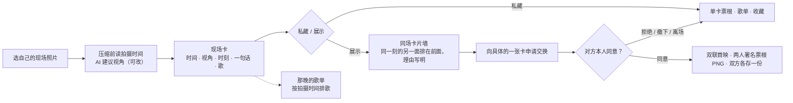

# Music Space · 产品方案

版本：**3.0 · 2026-09-30**，对应应用 **MVP 0.16.0**。这是独立产品 Music Space 的第一版方案，取代 2.6（Music Map × Music Space，对应 0.15）。本文由开发侧起草，队友（产品负责人）尚未审阅。

写作时的状态（2026-09-30 11:51 +08:00 用 gh 与 curl 核对）：工作分支 `feat/moment-ai`（`348fe02`、`f9a2d75`、`df8c8cd`、`7c962e2`，另有未提交的改动）**没有推送、没有 PR、没有合并**，远端只有 `main`（`a45ecbd`）与 `gh-pages`。线上 <https://musicmapteam.github.io/musicSpace/> 是 `feat/moment-ai@7c962e2` 的静态版构建（`gh-pages` 分支 `2d8f1a3`，带 `ai/`，2026-09-30 11:18 +08:00 部署），**不含之后的改动**；此前上线的是没有 AI 的 `main@a45ecbd`。0.15 里属于 Map 的规则、数据和画面不在本文，留在 Git 提交 `3dd102c` 与 [musicMapTeam/musicMap](https://github.com/musicMapTeam/musicMap)；两个产品各自编号（Map 仓库同为 MVP 0.16.0，两者互不相干）。

读法：**已实现**＝代码存在，并有 §6 写明的检查；**未验证**＝代码存在，没在目标环境检查过；**计划**＝还没做；**待决定**＝要团队定。事实与计划分开写，不把计划写成结果，也不估计获奖概率。构建、画面与验证记录登记在[项目状态](../../docs/PROJECT_STATUS.md)；实现细节见[实施规格](03-build-guide.md)，比赛交付见[交付计划](02-delivery-plan.md)。

## 1. 定位

**同一刻，另一面。演唱会散场后，同场观众交换彼此没有的视角。**

你拍到了舞台，朋友记住了人海。各自留下一张现场卡，向对方申请交换；对方本人同意后，两张卡合成一张两人署名的双联票根，收进各自的纪念册。「同一刻」按照片自带的拍摄时间判断，「另一面」按视角判断；视角由一个在你自己设备上运行的小模型建议，为此照片不上传。

### 要解决的问题

散场后，每个人只带走自己座位的那一个角度：你拍到舞台，身边的人拍到举起的手臂和整片人海，另一个人留下了灯光亮起的那一秒。想把别人的这一面补进自己的记忆，现在只有两条路：

- **翻社交平台上的「返图」。** 图很多，但找不到「我在的那一刻」：没有哪张图标着 21:47，也没有人告诉你哪一张和你的这一刻对得上。
- **向陌生人要原图。** 尴尬；图在群和平台之间转来转去，拍的人就丢了——署名没了，也没有一个「对方也愿意」的确认。

这是团队对使用场景的判断，是产品假设，不是研究结论：还没有做过目标用户访谈或试用，不据此宣称需求已经成立（怎么验证见 §8）。

### 第一批用户与使用时机

同场观众，散场以后、返程前后，从小圈或组织者发出的同一条邀请（邀请码、链接或二维码）进入：校园演出、小型 Livehouse、朋友一起去的现场。不把陌生人供给当作启动前提，不做全城匹配。

### 为什么不直接用群聊或共享相册

群聊和共享相册已经能收齐照片。Space 多做的是四件事：

| | 群聊 / 共享相册 | Music Space |
| --- | --- | --- |
| 找到同一刻 | 自己翻；没有统一的拍摄时间 | 按拍摄时间（相差 ≤ 3 分钟）和视角，把「同一刻的另一面」排在前面，理由写出来供核对 |
| 对象明确 | 发给「群」 | 申请指向具体的一张卡 |
| 双方同意 | 发出去不必问 | 对方本人同意才交换，发起者不能代答 |
| 署名保留 | 靠自觉 | 双联票根印两位作者；已同意的快照不因改卡而变 |

限度要说清：已展示的照片仍可能被看见或截屏，交换不解锁照片，也不防复制；只想收齐照片，共享相册更直接。多这一步是否值得，要靠真实观众来判断（§8）。

## 2. 主线

现场卡 → 私藏 / 展示 → 申请交换 → 对方同意 → 两人署名的双联票根 → 纪念册（「收藏」）。

一个人也有收益：没遇到合适的对象时，一张自己的卡也能保存（房间版可存成单卡 PNG），写下的歌会排进「那晚的歌单」，这些不依赖对方。但产品本身仍要展示现场、他人、回应、双方同意与交换结果。

## 3. 规则

### 3.1 现场卡

| 字段 | 规则 |
| --- | --- |
| 照片 | 自己的现场照片，或明标「AI 示例图」的预置图。选中后先在浏览器里缩小并重新编码（最长边 ≤ 960 px），重新编码不带定位信息。房间版只收 JPG / PNG / WebP（iPhone 的 HEIC 要先转 JPG），压到 JPEG ≤ 300 KB；示例页压到约 80 KB，只存本机 |
| 拍摄时间 | 见 §3.3。示例卡的时间是虚构的 |
| 视角 | 舞台 / 人海 / 身边 / 细节。可以留空，不替人猜；留空的卡不会被标「同一刻的另一面」 |
| 时刻 | 返场 / 全场合唱 / 灯光亮起，三选一 |
| 一句话 | ≤ 80 字 |
| 这一刻在唱的歌 | 选填，≤ 40 字，一行文字；会排进「那晚的歌单」 |
| 可见范围 | 默认私藏；「展示到本场」之后同场的人才看得到（「公开」只指房内可见） |

房间里每人一张卡；房间由创建者命名，可选填日期、城市和共同歌名（创建者填了歌名时，卡上可勾「带上这首歌」）。自填的场次、视角、时间和照片都不构成到场认证。

### 3.2 交换与同意

- 交换必须指向两张确定的卡。发送时带上双方卡的版本号，确认期间任一方改了卡就先请对方看新版，不默默替换；申请保存当时的两张卡快照，之后改卡不改写这次申请。
- 只有指定的接收者能接受或拒绝，只有发起者能取消；不能和自己交换；同一对人在同一房间最多一条待回应申请。
- 撤下卡或离开房间会取消相关的待回应申请；已接受的快照保留。
- 接受只表示这一次卡片交换：不自动成为好友、不开私聊、不交换联系方式。
- 接受后，服务在同一个事务里为双方各存一份纪念记录。删除自己的记录不影响对方的那份，也不撤销已接受交换对照片的读取依据；已展示、已下载的副本收不回。
- 示例页是同一浏览器里的两个虚构角色（Lin / 阿遥）的本地演示，写明「情景演示」；两张卡的同一版本已有完成的交换时，直接打开已有双联，不重复申请。它不是跨设备交换。

### 3.3 拍摄时间

- **读取**：选照片时，在压缩之前从原图读 EXIF 拍摄时间（先 `DateTimeOriginal`，再 `DateTimeDigitized`）；压缩会丢掉全部 EXIF，所以必须先读。覆盖 JPEG / HEIC / AVIF / PNG / WebP / TIFF。全程在浏览器里：先读文件头部一小段，必要时再读几段有上限的字节，不上传。
- **时区**：一律按北京时间显示。照片带时区偏移就换算，并在卡上说明（例如「已换算成北京时间，照片自带的是 4月7日 20:18（UTC−07:00）」）；不带就当作北京时间，也说明（「照片没写时区，按北京时间算」）。
- **只读时间，不读位置**：不读经纬度，不用位置配对。唯一读到的 GPS 字段是 UTC 日期与时间戳，只在照片没写时区偏移时，拿它和本地时间之差推算时区（取整到 15 分钟）。重新编码后的照片也不带定位信息。
- **哪些时间能用来判断「同一刻」**：

  | 来源 | 含义 | 参与判断 |
  | --- | --- | --- |
  | `exif` | 读到的拍摄时间 | 是 |
  | `manual` | 本人填写或改过的时间 | 是 |
  | `sample` | 示例照片的虚构时间（只在示例页，不会写进房间） | 是（只在示例页） |
  | `file` | 文件修改时间，或修图软件、PNG 里写下的时间：只是预填的猜测，标「大约的时间」；只留在页面上（示例页存在本机），**不发给房间服务**，服务端即使收到也只存成「没有拍摄时间」 | 否；本人一改，它就成了 `manual` |
  | 没读到 | 明说「没读到拍摄时间（截图或转发的图常会丢失）」，可自己填，或留空 | 否 |

- **范围**：2000-01-01 到「现在 + 1 天」，服务端同样校验；填了范围外的时间，会在时间框旁说明「没有采用」，不静默丢掉。
- **时间是卡的一部分**：房间版随卡保存（`takenAt` 毫秒时间戳与 `takenSource`，只有 `exif` 与 `manual` 会发给服务），同场能看到这张卡的人会看到「拍摄于 21:47」，交换快照、纪念记录与票根也带着它；静态版只存本机。
- **已知限度**：截图、转发、被压缩过的图常常没有拍摄时间，这时「同一刻」退回按所选时刻判断，或由本人手填。真实观众的照片里有多少保留了拍摄时间，没有统计过；iPhone 选图时 HEIC 转 JPEG 后是否保留拍摄时间也未验证。

### 3.4 「同一刻」与「另一面」

| 情形 | 判断 | 卡上怎么写（理由都是人能核对的话） |
| --- | --- | --- |
| 两张卡都有可信拍摄时间，相差 ≤ 3 分钟 | 同一刻 | 「同一刻 · 21:47，相差 1 分钟」（不到 10 秒写「几乎同时」，不到 1 分钟写「相差不到 1 分钟」） |
| 至少一张没有可信时间，两人选了同一「时刻」 | 同一刻（按所选时刻） | 「按你们都选的「返场」算同一刻（你的照片没有拍摄时间）」 |
| 两张都有时间，相差 > 3 分钟 | 不算同一刻，即使选了同一时刻 | 「你们都选了「返场」，但拍摄时间隔了 2 小时，不算同一刻」 |
| 缺时间，且所选时刻不同 | 不比较 | — |

3 分钟按精确的 3:00 为界，句子不会在界线两边写成同一个数：「相差 3 分钟」是不超过 3:00，多一点就写「隔了 3 分多钟」并判为不算同一刻；1 分半写「相差 1 分多钟」，而不是四舍五入成 2 分钟。

「另一面」＝同一刻，且两张卡的视角都已选定、并且不同：标「同一刻的另一面」，理由写出双方视角，如「同一刻 · 21:47，相差 1 分钟；你拍舞台，TA 拍人海」。视角相同只算「同一刻」（「你们都拍了舞台」）。

- **排序**（照片墙）：相关度，再看时间差小的在前，再看拍摄时间（没有时间的在后），最后是制卡先后。两人都写了同一首歌，相关度略加并在理由后写「；都写下了《晴天》」——排序不是秘密，理由写在卡上。内部的相关度分值不展示，也不称契合度。
- **在哪里看到**：房间的「同场卡片」分为「和你同一刻」与「这一晚的其他视角」（只在两组都有内容时分组），最靠前的「同一刻的另一面」上有标签（已经和你有双联的卡不再标）；示例页的配对提示；申请与回应弹窗里的理由。
- 这些规则是普通程序（`web/js/moment.js`，无 DOM、无依赖，`npm test` 覆盖），不含模型。

### 3.5 视角建议（端侧 AI）

产品里唯一的模型，只做一件事：看一张照片，建议它拍的是哪一面。

- **模型与运行方式**：TinyCLIP-ViT-8M/16 的图像塔（MIT，int8，8.8 MB），由 onnxruntime-web 1.30.0（WebAssembly，单线程）在浏览器里运行。四个视角的文字向量在开发机上预先算好、随包发布，浏览器里不跑文字塔。模型、运行时与向量都从本站同源的 `./ai/` 加载，运行时不访问 huggingface.co 或任何 CDN。
- **只在有把握时替人选**：最可能的视角与第二名的余弦差 ≥ 0.02 且概率 ≥ 0.5，才预选并标「AI 判断：舞台」；否则写「不确定，请选择」，把最可能的两项画成虚线框，一项都不选。
- **人选的永远优先**：人点过的视角不会被覆盖；换一张新照片是新问题，视角清空后模型可以重新回答。保存不等模型：保存时模型还没回答且没选视角，这张卡就没有视角，保存后的提示会说明，并给「选一个视角」。
- **不当作事实**：卡上只存最终视角，不记它是不是 AI 建议的。文案只说「AI 在本机判断，照片不上传」（房间页：「AI 在本机判断，判断时照片不上传；保存现场卡时才上传照片」），不说准确，不说确定。
- **不能运行时不宣传**：需要 WebAssembly SIMD 与 `createImageBitmap`，且页面要经 http(s) 提供。从本地文件（`file://`）打开、浏览器不支持、载入失败时，首页与制卡里不再写 AI，视角请自己选，只在「关于」里用一句话说明原因。
- **代价**：第一次要下载模型，界面写「首次需下载模型（约 10–23 MB）」：托管方压缩传输时约 10 MB，不压缩约 23 MB。2026-09-30 在 Pages 上用 curl 带 gzip 实测，五个 `ai/` 文件都带 `content-encoding: gzip`，共 10,344,436 B（模型 6,590,919、wasm 3,722,335、其余三个共 31,182）；这是开发机网络上的数字，不代表大陆网络。点开选照片入口时才开始下载，只用示例图的人不下载；浏览器开着省流量模式时，点开入口不预取，选定照片后仍会下载。之后放进浏览器的 Cache Storage；纯 http 的局域网页面没有 Cache Storage，只能靠浏览器的 HTTP 缓存，最坏每次重新下载。桌面 Chrome 上每张判断约 0.3–0.4 秒，期间页面不响应；手机上没测过。AI 慢或失败都不挡制卡和保存。
- **准确率**（只有公开图上的数字）：在 75 张维基共享资源（Wikimedia Commons）的 CC 授权照片上（不在本仓库），最初的 spike 是 top-1 92%。按应用自己的路径（先压缩再判断）测：判为「有把握」的 57 张全对，另 18 张没把握、真实视角都在前两名里；连同原图与六种退化（变暗、裁切、模糊、缩小、倾斜、微信式压缩）共 525 个样本，402 个过了「有把握」的门槛，其中 400 个对（99.5%），2 个错（变暗和裁切后的舞台照，都判成了「身边」）。这是公开照片上的数字，没在真实观众的手机照片上量过，不作为产品准确率；「有把握」只表示可以预选，不表示正确。`scripts/ai/README.md` 等处的「59 张有把握、全对，另 16 张没把握」是 spike 直接跑原图的结果，与这里的 57 / 18（先经应用的压缩再判断）输入不同，两组不互相替代。
- **示例照片不跑模型**：示例图自带预设的视角（舞台 / 人海）与虚构的拍摄时间；只有使用者换上自己的照片才会读时间、跑模型。
- **配对里有没有 AI**：配对、排序与理由都是普通规则。模型的输出只在一处进入产品——替人预选的那个视角，而人可以改。

### 3.6 「那晚的歌单」

- **来源**：卡上选填的「这一刻在唱的歌」（去掉控制字符和外层《》），以及房间创建者填的共同歌名（该卡勾了「带上这首歌」）。写法不同的同一首（全半角、大小写、空格、《》）合并成一行。
- **顺序**：按拍摄时间从早到晚（同一首取最早的可信时间）；没有可信时间的歌排在后面，先制卡的在前；「文件时间」不把歌放上时间线。
- **谁的歌**：只列看得到的卡——自己的卡（含私藏的）和同场已展示的卡，每行写出是谁写的。
- **链接**：每首带「在 QQ 音乐搜索《X》」（`https://y.qq.com/n/ryqq/search?w=…&t=song`，新标签页打开）和「复制歌名」。这只是按歌名搜索，不是核实过的同一录音直达页，页面上也这样写。桌面浏览器能带着搜索词到搜索页；手机上 QQ 音乐会转到它的手机首页并丢掉搜索词（2026-09-30 用桌面与 iPhone UA 的 curl 复查，见项目状态），所以另给「复制歌名」。
- **示例**：示例场次里虚构的曲目《把晚风借给你》标「示例」，没有链接；用户自己写了同名歌则可搜索。
- 没有内置音频，也不接账号或歌单授权。

### 3.7 双联与票根

- 对方同意后，全屏夜场仪式页首映：两半照片从两侧合拢，中缝闪光，存根展开，「双方同意」印章落下；同一浏览器再看只做简短回看（「看过」只记在本浏览器）。三个入口共用这一页：房间里接受之后、收藏里翻开、示例页接受之后。申请、拒绝与取消不出现成功画面。
- 主按钮「保存双联图片」：**1600×1800** 的夜场票根 PNG。两半各印作者、照片、视角与时刻、拍摄时间（只印可信的）、一句话和自己的歌；中缝的存根印让两张卡相遇的理由——同一刻（带时间）、两人都写的歌、共同的时刻，或这一晚——再加「双方已同意共同署名」。不在活动当天拍的照片印自己的日期（「拍摄于 2025年7月10日 10:53」），不和活动日期并排。预置图带「AI 生成示例照片」标记。页脚只把虚构的部分写成虚构：示例页全是示例内容时写「本地情景演示，角色、现场与歌曲为虚构」；使用者放了自己的照片或歌名时写「本地示例，角色、场次为虚构；含使用者提供的照片与歌名」，不把使用者自己的内容说成虚构。
- 房间版另有单卡 PNG（「我的现场卡」版式）。支持文件分享的浏览器才显示分享按钮，且只由用户点击触发。

### 3.8 静态版与房间版

| | 静态版 | 房间版 |
| --- | --- | --- |
| 是什么 | 整个 `dist/`：`index.html` + `ai/`，无后端，任意静态托管（含 GitHub Pages）。只放 `index.html` 也能用，只是没有 AI | Node 24 + 内置 SQLite 服务，同一进程提供页面（含 `ai/`）与 `/api/live` |
| 怎么判定 | 页面来源里没有房间服务写下的标记就是静态版，不发任何探测请求；`file://` 与 `*.github.io` 上即使带标记也忽略 | 服务在自己提供的 `index.html` 的 `<head>` 里写 `<meta name="space-rooms" content="1">`，页面立刻按房间版显示，并在后台用 `/api/live/health` 确认（失败隔 1.5 秒再试一次，仍失败退回静态版，不重载）。只有 Vite 开发服务器（有代理）会探测一次 |
| 能体验 | 本地双角色示例（`#/space/demo`），可换成自己的照片，缩小并去掉定位信息后只存在这台设备上 | 真实房间：匿名身份、6 位邀请码与二维码、每房最多 24 人、每人一卡，两台设备各自申请与同意；本人跨场次的卡与双联可回访 |
| 首页 | 「体验示例」为主、「用我的照片」为辅；导航「小院 / 示例 / 收藏」；房间入口隐藏，`live` 路由与 `?room=` 邀请一律进示例（并去掉 `?room=`），统一说一句「真实房间需要完整版服务；线上可先用示例体验完整流程」，不写成故障 | 「记录我的现场」「邀请朋友」，另有「继续本场」「我有邀请码」，「体验示例」作侧门；导航「小院 / 照片墙 / 收藏」 |
| 不能宣称 | 跨设备交换、真实房间 | 已上线托管（尚未选定主机，见 §9） |

房间的匿名身份只保存在当前浏览器，服务端只存它的哈希；清除站点数据后无法找回，也没有账号。上传的照片存在服务的私有数据库里，不放公共目录：只有照片主人、同房间里该照片正在展示的成员、待回应或已接受交换的双方，以及持有引用它的纪念记录的人能读。

### 3.9 浏览器存储

- `localStorage`：`music-space:v1`（示例页状态）、`music-space-live:v1`（房间的匿名身份）、`music-space-duet-seen:v1`（看过的双联，最近 60 个，只决定首映还是回看）。Cache Storage：`music-space-ai-v1`（模型、运行时脚本与 wasm）。
- Space 与 Map 部署在同一个 github.io 源，存储按源共享、不按路径隔离。所以 Space 只用 `music-space-` 前缀的键，**不写、不改、不删** Map 的键（`music-map-space:v1`、`music-map-live:v1`，以及不读的 `music-map-saved-music:v1`）。
- 只在首次启动、Space 自己的键不存在时，各复制一次 0.15 留下的示例状态与房间身份；之后旧键原样保留。Map 0.16 会剔除它自己键 `music-map-space:v1` 里的 `space` 与 `actor` 字段（Map 仓库 `61d0689` 的 `web/js/app.js`），所以同一浏览器若先打开了 Map，旧示例状态已经没了，Space 的示例从头开始；房间身份 `music-map-live:v1` 不受它影响。
- 浏览器拒绝写入时（存储已满 `quota`，或被禁止 `blocked`），顶部提示、toast 与「卡片已保存」对话框都改口，不再说「已保存」；房间页的「已保存」指服务端已保存，不受影响。服务端判定身份失效（401）后，`music-space-live:v1` 写入 `null` 而不是删除，避免服务端已丢弃的身份被当成 Map 时代的身份领养回来。

## 4. 页面与画面

| 页面 | 首先看到什么 | 主要动作 | 画面 |
| --- | --- | --- | --- |
| 首页（小院） | 夜场小院上的首屏：眉行「音乐现场 · 散场以后」、大字「同一刻，／另一面。」、一句承诺，以及三步「拍下这一刻（AI 可用时写「AI 在本机判断视角」）｜找到同一刻的另一面｜双方同意，交换留念」；回访用户不显示三步 | 静态版「体验示例」「用我的照片」；房间版「记录我的现场」「邀请朋友」「继续本场」「我有邀请码」 | [桌面](../../docs/assets/themes/space-home-desktop-v016.png) · [手机](../../docs/assets/themes/space-home-mobile-v016.png) |
| 示例现场（`#/space/demo`） | 两位虚构角色的卡、角色切换、「那晚的歌单」 | 制卡、展示、申请、切角色同意、看双联 | [桌面](../../docs/assets/themes/space-demo-wall-desktop-v016.png) · [手机](../../docs/assets/themes/space-demo-wall-mobile-v016.png) |
| 制卡 | 选照片后出现「拍摄于 …」与「AI 判断：舞台」（或「不确定，请选择」加虚线框） | 选视角、改拍摄时间、写一句话与歌、决定展示 | [桌面](../../docs/assets/themes/space-editor-ai-desktop-v016.png) · [手机](../../docs/assets/themes/space-editor-ai-mobile-v016.png) |
| 配对理由 | 「同一刻的另一面」标签与理由 | 申请交换 | [桌面](../../docs/assets/themes/space-pairing-desktop-v016.png) · [手机](../../docs/assets/themes/space-pairing-mobile-v016.png) |
| 那晚的歌单 | 按拍摄时间排的歌，每首带 QQ 音乐搜索与复制歌名 | 搜索、复制 | [桌面](../../docs/assets/themes/space-setlist-desktop-v016.png) · [手机](../../docs/assets/themes/space-setlist-mobile-v016.png) |
| 双联仪式页 | 全屏夜场：两半照片、存根、「双方同意」印章 | 保存双联图片、返回现场 | [桌面](../../docs/assets/themes/space-duet-desktop-v016.png) · [手机](../../docs/assets/themes/space-duet-mobile-v016.png) |
| 收藏 | 纪念册：本人现场与已保存的双联（静态版只有「示例」） | 回看、下载、删除本人那份、继续场次 | [桌面](../../docs/assets/themes/space-records-desktop-v016.png) · [手机](../../docs/assets/themes/space-records-mobile-v016.png) |
| 票根 PNG | 应用实际导出的 1600×1800 双联票根 | — | [票根](../../docs/assets/themes/space-ticket-v016.png) |

上表的图是 0.16 版画面，统一放在 `docs/assets/themes/`，命名为 `space-<页面>-<desktop|mobile>-v016.png`，由专门的截图轮次生成；文件缺失时以项目状态的记录为准。顶部是品牌「Music Space」（副标「樱下放映 · 散场以后」）加一套空间导航；房间版为「小院 / 照片墙 / 收藏」，静态版第二项为「示例」。

## 5. 艺术方向

冻结为「樱下放映 · 夜场」，只打磨，不再换方向。用户于 2026-09-27 明确：“优秀的视觉包装是我们项目能否成功的根本”，所以功能取舍、交互、网页与比赛材料都围绕这套画面安排。

- 一个常驻的三渲二夜场小院：夜空靛紫（theme-color `#23214a`）、地平线暖辉、串灯琥珀、暖纸、樱粉、鼠尾草绿；月光是唯一投影光；七盏常驻灯，切换镜头只补间强度。镜头 `home` 小院、`live` 照片墙、`editor` 工作桌、`records` 收藏、`photo` 照片近景，对应导航「小院 / 照片墙 / 工作桌 / 收藏」。
- 界面是暖纸、细墨线、票签、照片托盘与纪念册；照片、作者署名和下一步动作占主画面，说明放在需要决定的地方。正文不小于 14px，辅助文字不小于 12px，点击目标不小于 44px。
- WebGL 不可用时回到浅纸深字，制卡、申请与同意仍可操作；减少动态时直接显示终态。
- 复用 Sakura Crossing 的 MIT 渲染模块（cel、深度描线、调色、FXAA，固定提交见 `web/js/vendor/sakura/SOURCE.json`，本项目不修改）、Three 0.186.1、GSAP 3.15.0（Standard No Charge 许可）与 OverlayScrollbars 2.16.0；小院几何、程序纹理、夜场取值与构图是本项目自己写的。许可见 [THIRD_PARTY_NOTICES](../../THIRD_PARTY_NOTICES.md)，规范见 [VISUAL_THEMES.md](../../docs/VISUAL_THEMES.md)（其中仍含唱片店与寻声段落，待改写）。

## 6. 实现状态

代码存在不等于验证，更不等于已部署。「验证轮次」指经 Tabbit（Chrome 152）在 1440×900 与 390×844 模拟视口下做的独立检查，另含 `file://`、无 WebGL 与两个来源的房间流程；最近一轮 12/12 项通过、0 个页面错误，另有 14 条次要发现；逐项内容和这 14 条的处置没有存进仓库（项目状态把它列为待办）。没有触屏、实体手机与其他浏览器的记录，减少动态也没有独立验证记录。

| 能力 | 状态 | 依据与边界 |
| --- | --- | --- |
| 拆分为独立产品，Map 已移除 | 已实现 | `main` 上的 `c455279` … `a45ecbd`；前端里只剩对 0.15 旧存储键的一次性读取；远端「Build demo」在 `a45ecbd` 上通过（run 36595874461，当时的工作流只有 `npm ci`、`npm run build`、`node --check`） |
| 静态版在线演示 | 已部署：`feat/moment-ai@7c962e2` 的构建（带 AI）；**之后的改动未部署** | `gh-pages` 分支 `2d8f1a3`「Deploy Music Space static build from feat/moment-ai@7c962e2 (index.html + ai/)」（2026-09-30 11:18 +08:00）；此前是 `a45ecbd` 的单文件 `f0ad219`（00:18 +08:00）。11:51 +08:00 用 gh 与 curl 核对：`ai/tc8/labels.json` 返回 200，`index.html` 1,747,253 B、没有 `space-rooms` 标记（静态版） |
| 现场卡：照片、拍摄时间、视角、时刻、一句话、歌 | 已实现 | `moment.js`、`space.js`、`live.js`；`npm test` 通过（本文写作时复跑，Node 24.19.0）；验证轮次走过示例页与房间页 |
| 读取 EXIF 拍摄时间 | 已实现 | `web/js/ai/exif-time.js`；对 spike 的 96 个样本，94 个与 ExifTool 一致，另 2 个是已记录的已知上限（段 / 块超过 64 个时读取器返回空）；样本不入库 |
| 端侧视角建议 | 已实现，只在桌面 Chrome 上实测 | `web/js/ai/space-ai.js`；准确率数字见 §3.5；手机上的耗时、内存与页面停顿未测 |
| 同一刻配对与理由 | 已实现 | `moment.js`；`scripts/test/moment.test.mjs`（上百次断言） |
| 私藏 / 展示、申请、同意、快照、纪念记录 | 已实现（房间版）；示例页为本地双角色 | `scripts/test/api.test.mjs`（卡片校验、快照、纪念记录、收藏）；验证轮次的两个来源房间流程 |
| 双联仪式页与 1600×1800 票根 PNG | 已实现；新增的拍摄时间与歌名行**没有**导出文件的字节数与目视记录 | `duet-ceremony.js`、`ticket-export.js`；待 `space-ticket-v016.png` 一并留证（见项目状态） |
| 那晚的歌单与 QQ 音乐搜索链接 | 已实现 | `moment.js` 的 `buildSetlist`、`setlist-ui.js`；链接在手机上会丢搜索词（§3.6） |
| 静态版 / 房间版双模式 | 已实现 | `app.js`；静态版首页只发一个请求（`/`），房间版按标记判定，把 `/api/live/health` 拖慢到 4 秒时首页在 207 ms 已是房间版（集成阶段记录，Chrome 152） |
| 浏览器存储与写入失败提示 | 已实现；从 0.15 存档迁移到新键**没有**操作记录 | `storage.js`；写入失败用模拟的 `QuotaExceededError` 与 `SecurityError` 检查过，提示与 toast 都改口 |
| iOS Safari、微信内置浏览器、Android 与实体手机 | **未做** | AI 的耗时与内存、iPhone 选图后的拍摄时间、点击目标都未测 |
| 大陆网络下的访问 | **未做** | 见[交付计划](02-delivery-plan.md) §3.C |
| Pages 上 `ai/` 的传输大小 | 已测（开发机网络） | 2026-09-30 11:51 +08:00：五个文件都带 `content-encoding: gzip`，共 10,344,436 B；`index.html` 带 gzip 604,408 B。Pages 上 Cache Storage 的命中没测 |
| 目标用户试用 | **未做** | §8 |
| Space 版的介绍、封面与视频 | **未做** | 现有封面与视频含 Map 内容，不能直接用 |
| 队友审阅本文与产品决定 | **未做** | §9 |

**计划**（都没开始，不是承诺；日期与依赖见[交付计划](02-delivery-plan.md) §6）：把 `7c962e2` 之后的改动提交、推送并再部署；真机、微信内置浏览器与大陆网络检查；用至少 30 张真实手机现场照片量视角建议的准确率与「有把握」的比例，并评估把推理放进 Worker；小样本试用（§8）；为 Space 重做介绍、封面与视频；补拍 15 张 0.16 画面。

## 7. 不做

- 全城附近的人、开放广场、好友与私聊、联系方式交换。
- 票务、手机号账号与找回、自动到场认证（自填场次、视角、时间和照片都不构成到场认证）。
- 位置与地理配对。
- 内置音频、歌单账号授权、抓取音频、QQ 音乐「同一版本直达」（没核实过，只给搜索）。
- 服务端 AI、把用户照片送往任何第三方做识别、AI 契合度分数、个性化推荐、用 AI 生成回忆（AI 生成的只有明标的示例照片）。
- 通用活动相册、复杂的主办方后台、多实例横向扩展的 SQLite。
- Map 的一切（唱片店、寻声、完整图鉴、开放曲库、音乐收藏）：在 Map 仓库，不写成 Space 的一部分。

## 8. 怎么验证需求

**这是计划，没有执行结果。** 目标：知道观众是否愿意主动交换、是否比群相册多一份值得留下的东西。方案沿用[竞品研究](../../references/research/2026-09-27/social-product-review.md)第 9 节：招募经历同一场演出的观众，3 对同行朋友、3 对互不熟悉或弱关系，用他们愿意提供的真实照片，分别体验「共享相册 / 群里发图」的简化基线和 Space 的两卡流程，记录原话与行为，不由团队代替点击同意；预先约定的否决门槛写在该节里（团队约定，不是统计结论）。该方案写于决定加入端侧 AI 之前，没有把视角建议单独列为观察项，试用时应补上：预选对不对、用户改不改。距初赛截止只剩 9 天，**能做几对就做几对，写清楚人数，不外推留存率或获奖概率**。

同时要看的两件事，都是真实照片才暴露的：照片里带着拍摄时间的比例（决定「同一刻」多少次靠时间、多少次退回所选时刻），以及手机上 AI 加载与判断是否顺畅。

## 9. 待团队决定

下列都需要队友（产品负责人 igohomealone216）或用户拍板；本文不替任何人表态，也不把它们写成已定。

| 问题 | 为什么要定 | 现状 |
| --- | --- | --- |
| 提交 Music Space 还是 Music Map | 官网规则：每支队伍限定提交一份作品（FAQ Q12 同）。介绍、视频、封面、Demo 链接都取决于它 | 未决；2026-09-28 用户曾以 Map 为主线，2026-09-29 又恢复 Space 并保留 Map，见 §10；本仓库没有队友的意见记录 |
| 赛道：赛道一（TME 产品创新功能）还是赛道二（创新音乐产品） | 表单第 03 项 | 未决。Space 是独立的新产品，形态上更接近赛道二；走赛道一要指明落在 TME 的哪个平台、哪个体验空白。[参赛材料](../../docs/competition/README.md)里有赛道二主稿与赛道一短稿两种口径，赛道一那版只是设想的落点，没有核对该平台的现状，也没有任何对接 |
| 作品名称 | 表单第 02 项（用户还没贴这一项） | 「Music Space」是暂定名（它原是 2026-09-26 前双 App 方案里 Space 一端的名字，见 [original-ideas](../../references/original-ideas/README.md)） |
| 仓库与 Pages 是否保持公开；「上线」口径 | FAQ Q10：对外发布至公开平台、任何人可访问，视为上线；FAQ Q4 与官网「无在先使用行为」又要求参赛作品还没上线；FAQ Q8 建议入选前尽量不要开源。而提交要求评审能直接访问在线链接 | 2026-09-30 用 gh 与 curl 核对：仓库是公开的，Pages 站点也是公开的。这一种情形是否算「已上线」，官方口径没有直接回答，需向主办方确认；确认前不主动传播该链接 |
| `feat/moment-ai` 何时推送、开 PR、合并；`7c962e2` 之后的改动何时再部署 | 线上已经带 AI，但它对应的分支没有远端；之后的改动（如不再发送文件时间）还没上线 | 需要用户批准；上一轮的授权不自动延续 |
| 房间版是否上线托管 | 需要 Node 24、持久磁盘、HTTPS 与访问控制；官方决赛要求「成功部署上线」 | 未选定主机；现在只用局域网与录屏演示 |
| 真机检查：谁、什么设备、何时 | iOS Safari、微信内置浏览器、Android 都没测，AI 是最大的未知 | 未安排 |
| 大陆网络访问不稳时的备选 | 评委的网络环境未知；github.io 在大陆是否稳定没实测，而 `ai/` 有 23 MB | 未测，备选托管未选 |
| 目标用户试用的人数与招募 | §8 | 未开展 |
| 材料分工：介绍、封面、视频、配音或字幕 | 视频要真实操作录屏，需要两台设备 | 未分配 |

## 10. 决策记录

用户指开发侧（GitHub Alakazamc）。队友的意见没有出现在本仓库的记录里，下表不代为表态。

| 日期 | 决定或事件 | 依据 |
| --- | --- | --- |
| 2026-09-27 | 用户明确「优秀的视觉包装是我们项目能否成功的根本」；0.15 把美术方向冻结为「樱下放映 · 夜场」 | [AGENTS.md](../../AGENTS.md)；附录 A |
| 2026-09-28 | 用户决定转向只做 Map（Map-only pivot）：Map 继续在 musicMapTeam/musicMap（MVP 0.16.0，线上 <https://musicmapteam.github.io/musicMap/>，保持原样、没有删除）。细节尚待与产品负责人对齐 | [项目状态](../../docs/PROJECT_STATUS.md)；Map 仓库 `61d0689` |
| 2026-09-29 | 用户决定恢复 Space 并打磨；**AI 放进核心**（端侧视觉判断视角）；线上演示是静态版（GitHub Pages）。这取代 2.6「不增加模型推理」的表述（原文见附录 B） | 本文 §3.5；[AGENTS.md](../../AGENTS.md) |
| 2026-09-29 | 用户决定保留 Map，Space 另开新仓库 `musicMapTeam/musicSpace`，以 0.15（`3dd102c`）为起点，移除 Map 一半；该要求授权建仓并推送本分支，PR、合并与其他推送（含部署 Pages）仍先问用户 | [AGENTS.md](../../AGENTS.md) |
| 2026-09-30 | 执行记录（不是新决定）：00:10 +08:00 建仓；`c455279` … `a45ecbd` 完成拆分；00:18 部署静态版 `a45ecbd` 到 Pages；`feat/moment-ai` 上做了 AI、拍摄时间、同一刻配对、歌单与外壳（`348fe02`、`f9a2d75`、`df8c8cd`、`7c962e2`），该分支没有推送；11:18 +08:00 线上换成 `feat/moment-ai@7c962e2` 的构建（`gh-pages` `2d8f1a3`，`index.html` + `ai/`）；文档 3.0 起草 | `git log`；gh 核对 |
| 未决 | 提交 Space 还是 Map；赛道；名称；是否公开；是否托管房间版 | §9 |

---

## 附录 · 历史（2.6 原文保留）

以下是 2.6（Music Map × Music Space，0.15）里的原文，一字未改，按出处分块保留。其中的唱片店、寻声、完整图鉴、开放曲库与音乐收藏属于 Map，不是 Space 的功能；「不增加模型推理」等表述已被本文取代。2.6 的完整全文见 `git show 3dd102c:product/docs/01-product-plan.md`。

### A. 版本说明与 0.15 视觉整改（2.6 第 3、5 行）

版本：2.6 · 2026-09-27，对应应用 MVP 0.15.0。唱片店改为寻声一局（翻唱片找关联、分级提示、揭晓、连线歌单）与完整图鉴；本轮同时把小院改为夜场、补上首屏价值主张，并为双方同意的交换加入全屏仪式页。构建、实际画面和交付状态统一见[任务记录](../../docs/PROJECT_STATUS.md)；0.14 及更早证据保留原范围。

0.15 是视觉整改。用户原话：“优秀的视觉包装是我们项目能否成功的根本”，“这个找关系的玩法应该是探索性的，不是把结果全贴出来给用户了”。「樱下放映」由晴天午后改为傍晚到夜场演出，并冻结为最终美术方向；首页首屏先讲「同一刻，另一面」和交换三步；唱片店不再默认铺开完整网络，也不直接高亮最短链；双联改为全屏夜场仪式页，PNG 改为夜场票根；正文不小于 14px，辅助文字不小于 12px。本轮实际检查见项目状态。

### B. 被 3.0 取代的 AI 表述（2.6 §3 末段与 §7 首段）

不增加模型推理：官方公开口径允许AI Coding，现有的共同点判断用普通程序即可。AI使用按实际开发与素材制作过程说明，不把规则排序包装为音乐智能。

比赛允许 AI Coding。当前方案采用 AI 辅助产品梳理、界面制作和开发，提交材料如实说明实际使用；不为参赛额外安排本地模型或在线推理。模板排版、按共同歌曲匹配、基于事实的关系查询可以用普通程序实现。

### C. 艺术方向的版本演进与检查范围（2.6 §6）

**用户于 2026-09-27 明确：“优秀的视觉包装是我们项目能否成功的根本”。** 各版本的演进：0.11 确定只留樱下放映，0.12 统一小院物件语言，0.13 在同一樱花纸桌上呈现完整网状关系，0.14 按纸件占位安排镜头并收起次要内容。0.15 把小院从晴天午后改为傍晚到夜场演出，并将「樱下放映 · 夜场」冻结为最终美术方向，后续只做打磨，不再换方向。运行界面与 PNG 使用 `sakura`；声浪现场、独立刊物及主题切换保留为历史。艺术规范见 [VISUAL_THEMES.md](../../docs/VISUAL_THEMES.md)。

0.14 及更早的构建、场景和数据检查保留原范围，不自动成为 0.15 的结果。本轮构建、画面和交付按[项目状态](../../docs/PROJECT_STATUS.md)登记。以下几项均未验证：实体手机、真机双指、读屏软件，以及正常硬件下的仪式与开场亮灯时长。现有 106 秒视频与 16:9 封面仍对应 **0.4.0**，需按 0.15 重制，见[交付清单](../../delivery/README.md)。

### D. 比赛价值与停止扩张的标准（2.6 §8 正文，原标题「8. 比赛价值与停止扩张的标准」从略）

从用户路径审阅看，自己的照片能成为可带走的纪念物，双方同意后又能保留朋友的另一种视角，已有明确收获。0.11 整理邀请、草稿和回访，0.12 统一空间物件，0.13 补齐稳定全网并分开查看与行走，0.14 处理纸件遮挡主体、常驻内容过多与短屏弹窗拥挤。本轮把视觉改为夜场，首屏先讲清交换价值，并把找关系改为由用户自己翻开的寻声一局。音乐探索没有内置音频，提供的是作品发现、关系依据与收藏。寻声是否比完整网状图更能让观众记住具体合作，需要实际试用后判断。

先让少量目标用户走通演示，观察是否理解共同点、交换对象和双方同意，再问是否愿意保存另一视角。若只夸画面而不理解交换动机，先改场景与卡片内容。试用尚未开展，不填获奖概率、留存率或虚构满意度。

0.4.0 补足真实内容与可操作收益，0.5–0.8 调整视觉、阅读负担与空间，0.9 连接本人主页与收藏，0.10 精简制卡并呈现导出成品，0.11–0.12 统一樱花艺术与页面物件，0.13 形成稳定的完整关系网与真实回路，0.14 让镜头与纸件共同构图，0.15 改为夜场并冻结美术方向，补上首屏主张、寻声一局与双联仪式页。后续是否扩大陌生人社交，取决于少量真实观众能否说出具体交换理由、是否在意双人署名、是否愿意自主回应。建议以6对观众与共享相册／群聊简化基线做一次小样本比较，具体否决条件见竞品研究第9节；这些是团队决策门槛，不是已取得的数据。

真实观众是否愿意交换、是否比群相册多一份纪念价值，以及实体手机和跨设备使用是否顺畅，仍需真实试用。评审部署、目标用户试用、连续操作录像和正式提交分别记实。获奖需要评委判断，当前不填获奖概率或虚构满意度。材料的实际版本见[交付清单](../../delivery/README.md)。
