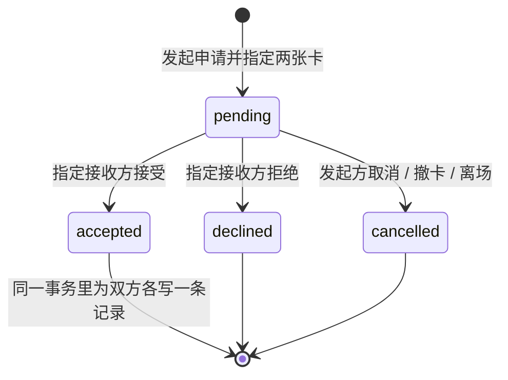

## 当前阶段 · 2026-10-02 长期音乐社群

主办方长期空间与具体演出场次分开；场次出席、聊天室成员、社群成员三种资格独立。散场不删除消息和好友关系；主动退出或被移出会失去该聊天室的读取与发送资格，恢复资格后仍需本人明确重加。照片和定向交换不因加入社群或成为朋友扩大。社群新招呼需双方主动选择愿意、当前成员资格且未拉黑，双方接受后复用现有好友私聊；当前先要求主办方关联一个实际场次记录作为联系来源，不冒充到场。

自愿加密身份备份绑定实际同源服务；恢复需核验服务仍认可身份并明确替换本浏览器身份，旧页面立即清空私密视图并重载，不代真实用户导出密钥。没有备份或服务数据已删不承诺找回。完整顺序见[实施清单](../../docs/event/COMMUNITY_ROADMAP.md)，实现/验收状态见[项目状态](../../docs/PROJECT_STATUS.md)。后续Map分享探索、专辑世界杯、统一原生/Web入场和双人角落还在Todo；不把计划写成实现。

# 2026-10-02 · RC.4 体验收尾

当前主线是 /event-room/ 的音乐现场社交：真实三维场馆、可组合手绘二维小人、照片、自愿联系、双方接受后的文字私聊与散场回顾。安静参与仍可保留/分享照片和自愿交换；愿意打招呼不自动建立朋友。

回顾增加个人纪念卡：用户明确选择当前页最多两张本人照片、可选自己的已保存小人，确认后本地导出带署名的 1080×1440 PNG，也可保存无照片文字票。不包含他人/交换照片、关系名单和私聊，不上传或自动公开。删除、身份/造型改变、断网或取消时重新核对，不能输出旧材料。已有下载副本无法召回。

Node 24+ 同源 API 和持久 DATA_DIR；runtime-preview/src 与 drizzle 是共享实现且随运行包保留。本机双身份 35 步实际 GPU 浏览器检查已过；真机/微信/大陆网络和真实观众研究仍待做。[本轮证据](../../docs/event/evidence/memory-closeout-qa.md)，[预发布说明](../../docs/release/0.17.0-rc.4.md)。没有新公网部署、旧 gh-pages 更新或比赛提交。

以下版本记录为历史，冲突时以上述当前规则及根 README 为准。

# 2026-10-01 交付状态补充

本轮为 Music Space 0.17.0-rc.1 场次房间预发布：同场人物、照片、双方同意交换、私聊与成员管理；Node 同源服务使用持久 SQLite，交付独立 /event-room/，旧静态站不覆盖。有限验收已完成，不等于公网/手机/生产验收。部署与未测项以 [根 README](../../README.md)、[部署说明](../../docs/deployment.md) 和 [检查记录](../../docs/release/0.17.0-rc.1.md) 为准。下文旧版本规划保留为历史。

# Music Space · 实施规格

版本：**3.0 · 2026-09-30**，对应应用 **MVP 0.16.0**，取代 2.6（Music Map × Music Space）。产品规则见[产品方案](01-product-plan.md)，比赛交付见[交付计划](02-delivery-plan.md)。本文写「代码现在是什么样」：模块、状态与存储、拍摄时间与配对的实现、端侧 AI 管线、房间服务、构建与部署、测试。

写的是 `main@54f3e6e`（PR #1 于 2026-09-30 14:03 +08:00 由 `feat/moment-ai` 合并而成）的样子；线上（`gh-pages` `e28fab5`，14:04 +08:00 部署）是这一提交的构建。构建与浏览器检查的记录登记在[项目状态](../../docs/PROJECT_STATUS.md)，本文 §9 只摘要。2.6 里属于 Map 的部分（寻声、完整图鉴、开放曲库、音乐收藏，及其存储与数据）不在本文，见 `git show 3dd102c:product/docs/03-build-guide.md` 与 Map 仓库；2.6 里的历史证据在附录原文保留。

## 1. 技术决定

| 部分 | 当前实现 | 边界 |
| --- | --- | --- |
| 页面 | HTML / CSS / 原生 JavaScript ES 模块；Vite 8.3.1 + vite-plugin-singlefile 2.3.3；hash 路由：`#/space`（首页，没有 hash 也进首页）、`#/space/demo`（本地示例）、`#/live`（照片墙）、`#/records`（收藏） | 不迁移框架；依赖由 `package-lock.json` 固定；`vite.config.js` 的 `base: './'`，所以能挂在子路径（如 `/musicSpace/`）下 |
| 构建产物 | `dist/index.html`（脚本与样式内联，约 1.7 MB）加 `dist/ai/`（`web/public/ai/` 原样复制，约 23 MB，不内联），合计约 25 MB | **静态部署的单位是整个 `dist/`**，不再是单个 HTML |
| 视觉 | Three 0.186.1 常驻夜场小院 + Sakura Crossing cel / 深度描线 / 调色 / FXAA（MIT，`web/js/vendor/sakura/`，不修改）+ GSAP 3.15.0 / Flip；DOM 纸件与投影标签 | 只有 `sakura`；手机独立机位；WebGL 不可用（`body.spatial-fallback`）时用二维布局与浅纸深字 |
| 滚动 | OverlayScrollbars 2.16.0（自动隐藏的细浮动条），弹窗用原生滚动 | 仅前端依赖 |
| 端侧 AI | TinyCLIP-ViT-8M/16 图像塔（int8）+ onnxruntime-web 1.30.0（WASM 单线程），同源自托管在 `./ai/`（§5） | 不访问 huggingface.co 与任何 CDN；没有服务端推理 |
| 拍摄时间 | `web/js/ai/exif-time.js`：原创、无依赖，压缩前读原图 | 只读时间，不读位置（§4.1） |
| 配对规则 | `web/js/moment.js`：无 DOM、无依赖，`npm test` 覆盖 | 不含模型 |
| 示例页状态 | `localStorage` `music-space:v1` | 仅当前浏览器 |
| 房间身份 | 匿名 bearer 凭据，浏览器保存在 `music-space-live:v1`；服务只存哈希 | 没有账号、找回与跨设备迁移 |
| 服务 | Node.js 24+，内置 http 与 `node:sqlite` 的 `DatabaseSync`；无运行时 npm 依赖 | 同源 `/api/live`；服务端校验成员与权限 |
| 数据库 | SQLite，默认 `data/music-map.sqlite`（沿用 0.15 的文件名，改名须配迁移），WAL 与事务；照片存独立表的 BLOB | 单实例加持久磁盘；`data/` 与 sidecar 文件不提交 |
| 二维码 | 浏览器里用 qrcode-generator 2.0.4 现场生成邀请链接 | 不调用外部二维码服务 |
| 输出 | 浏览器 canvas 绘制 1600×1800 的单卡与双联 PNG | 见 `ticket-export.js` |

## 2. 目录与模块

| 路径 | 职责 |
| --- | --- |
| `web/index.html` | 入口：`data-theme="sakura"`、theme-color `#23214a`、标题「Music Space · 同一刻，另一面」 |
| `web/js/app.js` | 外壳：路由、模式判定 `api.backend = { available, note }`、存储失败提示、toast、「关于」、导航（房间版「小院 / 照片墙 / 收藏」，静态版第二项「示例」）；`api` 还有 `getState`、`update`、`navigate`、`storageState`、`spatial.publish / focus / restore` |
| `web/js/home.js` | 首页首屏（眉行、大字、承诺句与三步，AI 可用时第一步写「AI 在本机判断视角」）与个人纸卡；数据与照片载入只重绘纸卡 |
| `web/js/space.js` | 本地双角色示例：制卡、展示、申请、切角色同意、示例记录；导出 `createSpaceState`、`mountSpace`、`mountSpaceRecords`；`upgradeSavedCards` 给旧存档补 `perspective`、`takenAt`、`takenSource`、`song` |
| `web/js/space-data.js` | 虚构场次「回声现场」（`SPACE_EVENT`）、两位示例角色、三个时刻、两张示例照片及其虚构拍摄时间（21:47、21:48）、种子卡 |
| `web/js/live.js` | 房间：入场、创建、邀请与二维码、两步制卡、照片墙（按 `orderWall` 分组排序）、申请与回应、「那晚的歌单」目录 |
| `web/js/live-library.js` | 「收藏」：本人跨场次的卡与双联，回访、删除本人那份双联 |
| `web/js/live-photo.js` | 照片授权读取的 blob 缓存（`createPhotoStore`）与房间版的 `preparePhoto`（JPG / PNG / WebP，最长边 ≤ 960 px，JPEG ≤ 300 KB） |
| `web/js/moment.js` | 「同一刻」全部规则：拍摄时间的读取结果整理、时区、格式化、可信度、`readPair`、`orderWall`、歌单、票根事实（§4.2） |
| `web/js/photo-insight.js` | 制卡编辑器读到的两件事的文案与状态：`readPhotoTime`、`identifyViewpoint`、`answerView`、`timeView`、`timeProblem`（范围外的时间在时间框旁说明）、`viewpointHint`、`warmUpViewpointAI`、`aiState`；不画东西、不上传 |
| `web/js/setlist-ui.js` | 「那晚的歌单」的绘制、QQ 音乐搜索链接与「复制歌名」（Clipboard API，纯 http 页面降级为选中复制） |
| `web/js/ai/exif-time.js` | EXIF 拍摄时间读取器（§4.1） |
| `web/js/ai/space-ai.js` | 端侧视角识别（§5.1） |
| `web/js/storage.js` | 存储键、旧键一次性领养、写入失败分类、房间身份读写 |
| `web/js/duet-ceremony.js`、`duet-facts.js` | 全屏双联仪式页（单例，首映 / 回看）与它和 PNG 共用的事实（共同线索、两半的视角与时间、日期与完成时间格式、页脚只把虚构部分写成虚构的 `inventedNotice`） |
| `web/js/ticket-export.js` | canvas 绘制夜场票根，`downloadTicket`（双联）与 `downloadCard`（单卡，房间版）；原生 dialog 展示成品、可再次下载、支持时提供分享 |
| `web/js/themes.js`、`sakura-scene.js`、`sakura-world.js`、`sakura-camera.js`、`sakura-framing.js`、`sakura-batch.js`、`sakura-printwork.js` | 常驻夜场小院：场景（七盏常驻灯，只补间强度）、镜头（`home` / `live` / `editor` / `records` / `photo`）、按纸件占位取景、静态网格合批、原创印刷纹理；场景接口 `setView`、`setContent`、`focus`、`restore`、`dispose`，最多同时贴 6 张卡 |
| `web/js/motion.js`、`icons.js` | GSAP / Flip 的界面动画（尊重减少动态）；图标 |
| `web/js/vendor/sakura/` | Sakura Crossing 的 MIT 渲染模块，`SOURCE.json` 固定上游提交；不修改 |
| `web/css/` | 各页样式；`night-shell.css` 最后加载（夜空上的奶油色品牌字、深色玻璃导航、暖纸夜间阴影、琥珀焦点环），`duet-ceremony.css`、`live-compose.css`、`library.css` 等；`body.spatial-fallback` 下回到浅纸深字 |
| `web/public/ai/` | 原样复制到 `dist/ai/`：`tc8/`（模型与标签，入 Git）、`ort/`（由 `npm run ai:ort` 生成，不入 Git）、两份 MIT 许可文本 |
| `web/assets/` | 示例照片（AI 生成，`image-provenance.json` 记来源）与各许可文本 |
| `server/index.js`、`server/db.js` | 房间服务与数据库（§6） |
| `scripts/ai/` | 模型来源、复现与检查脚本（§5.2、§5.3） |
| `scripts/test/` | `npm test` 的三份检查（§8） |

## 3. 状态、存储与迁移

### 3.1 存储

| 位置 | 键 | 内容 | 谁写 |
| --- | --- | --- | --- |
| `localStorage` | `music-space:v1` | 示例页状态：`{ version: 1, view, actor, space: { version: 1, cards: { a, b }, exchanges[], reactions, records: { a[], b[] } }, routePayload }` | `app.js` 的 `persist()` |
| `localStorage` | `music-space-live:v1` | 房间身份 `{ token, user, roomId, rejoinCode }`；服务端判定失效（401）后写 `null`，不删键 | `storage.js` 的 `saveSession` |
| `localStorage` | `music-space-duet-seen:v1` | 看过的双联的交换 ID，保留最近 60 个；只决定首映还是回看 | `duet-ceremony.js` |
| Cache Storage | `music-space-ai-v1` | `labels.json`、两个运行时脚本、模型与 wasm（换模型或运行时要一起改名） | `space-ai.js` 的 `CACHE_NAME` |

示例卡（本地）的字段：`id, revision, owner, eventId, photoKey('stage'|'crowd'|'custom'), photoDataUrl, perspective, takenAt, takenSource('exif'|'manual'|'file'|'sample'|null), song, momentId, trackId, caption, isPublic, createdAt, updatedAt`。照片压到约 80 KB（数据 URL ≤ 110,000 字符，最长边 960 → 560 逐档降），因为一张卡会被复制进每个申请与两份记录，全部放在 `localStorage` 里。

写入被浏览器拒绝时，`api.storageState()` 给出原因（`quota`：照片太大；`blocked`：浏览器禁止本地存储），顶部提示、toast 与「卡片已保存」对话框据此改口；说「已保存」的 toast 用 `api.toast(msg, { saved: true })` 标记。房间页的「已保存」指服务端已保存，不受它影响。

### 3.2 与 Map 同源共存

Space 与 Map 在同一个 github.io 源，存储按源共享、不按路径隔离。Space **不写、不改、不删** `music-map-space:v1`、`music-map-live:v1`，也不读 `music-map-saved-music:v1`；新增的键一律用 `music-space-` 前缀。

`adoptLegacyStorage(isValidSpace)` 在启动时、任何读取之前运行一次：

- Space 自己的 `music-space:v1` 不存在，且旧键 `music-map-space:v1` 里有 `version === 1` 且通过校验的 `space` 字段时，把它（加上 `actor`）复制进新键，只取 `space`，不取 `map`；载入时再丢弃 `map` 与 `space.mapReturnId`。
- `music-space-live:v1` 不存在，且旧键 `music-map-live:v1` 里有 `token` 时，原样复制。
- 写入失败（存储满或被禁止）就静默地从头开始。之后旧键原样保留。
- Map 0.16 会剔除 `music-map-space:v1` 里的 `space` 与 `actor`（Map 仓库 `61d0689` 的 `web/js/app.js`），所以同一浏览器先打开了 Map，旧示例状态就没了，Space 的示例从头开始；`music-map-live:v1` 不受 Map 影响。
- 401 后 `music-space-live:v1` 写 `null` 而不是删除：只有键**不存在**才会领养 Map 时代的身份，服务端已丢弃的身份不能回来。

**没有这条迁移路径的操作证据**（项目状态：待补）；代码存在不等于验证。

### 3.3 模式判定

页面自己决定是静态版还是房间版，结果是 `api.backend = { available, note }`：

- 房间服务在它提供的 `index.html` 的 `<head>` 里、内联脚本之前写 `<meta name="space-rooms" content="1">`（`server/index.js` 的 `markRooms`）。页面据此立刻按房间版显示，并在后台请求 `/api/live/health` 确认，失败隔 1.5 秒再试一次，仍失败就退回静态版（换掉房间路由、给出统一说明，不重载；已打开的示例或对话框等它关掉再刷新）。
- `file://` 与 `*.github.io` 上，标记一律忽略；没有标记的页面（`vite preview`、任意静态托管）按静态版，**不发任何探测请求**。
- 只有 Vite 开发服务器（`import.meta.env.DEV`，因为代理到本机服务）仍探测一次，并采纳晚到的答案（两个方向都可）。
- 房间相关的显示与跳转只读 `api.backend.available`，不各自探测。静态版里 `live` 路由不作为目的地，一律进示例，并给出 `api.backend.note`（「真实房间需要完整版服务；线上可先用示例体验完整流程」）；`?room=` 邀请参数会从地址里去掉；旧的 `#/explore` 书签落回首页。

## 4. 拍摄时间与「同一刻」

### 4.1 读取拍摄时间：`web/js/ai/exif-time.js`

- **入口**：`readCaptureTime(file)`（从不抛错；读不到给 `null`）与 `fallbackTime(file)`（只在读不到时给 `File.lastModified`，永远是近似）。
- **读取范围**：先读 `blob.slice(0, 128 KB)`；结构落在更后面时才再读，每次 ≤ 1 MB、最多 64 次段 / 块 / box 跳转（JPEG 的 APPn 之后、HEIC 的 Exif 项（libheif 放在文件末尾）、PNG / WebP 在像素数据之后的块）。
- **格式**：JPEG（每个 APP1 都试，区分 Exif 与 XMP）、HEIC / HEIF / AVIF、PNG（`eXIf`）、WebP（`EXIF`）、裸 TIFF；大小端都支持。
- **标签**：IFD0 → ExifIFD（`0x8769`）→ `DateTimeOriginal` `0x9003`，其次 `DateTimeDigitized` `0x9004`，再其次 IFD0 `DateTime` `0x0132`（文件修改时间，弱证据）；`SubSecTime*`、`OffsetTime*`、`Orientation`；GPS 只取日期 `0x1d` 与时间戳 `7`（见下）。
- **结果**：`local`（照片里存的墙钟时间，不带时区，不要交给 `new Date()`）、`offset`（先 `OffsetTimeOriginal`，再 `OffsetTimeDigitized`，再 `OffsetTime`；都没有就用「本地时间减 GPS UTC」推算并取整到 15 分钟，`offsetFrom === 'GPS'`；否则 `null`）、`epochMs`（真实时刻；**没有 offset 时为 `null`**，不猜时区）、`wallMs`（墙钟当作 UTC 的毫秒数，永不为 `null`）、`source`、`format`、`orientation`。
- **隐私**：只读时间相关的标签；**不读经纬度**；GPS 的 UTC 日期与时间戳只用来推算时区。重新编码后的照片不再带 EXIF。
- **已知上限**：段 / 块超过 64 个时返回 `null`（对 spike 的 96 个样本，94 个与 ExifTool 一致，另 2 个是这个已记录的上限）；样本与清单不入库。

### 4.2 规则：`web/js/moment.js`

| 函数 / 常量 | 作用 |
| --- | --- |
| `SAME_MOMENT_MS`（180000）、`TAKEN_MIN`（2000-01-01）、`takenMax()`（现在 + 1 天）、`validTakenAt` | 「同一刻」的窗口与时间范围（服务端同一窗口） |
| `takenFromExif(found)` | 读取结果 → `{ takenAt, trusted, zoneAssumed, origin }`；没有时区偏移就当作北京时间（`wallMs` 减 8 小时）；`source === 'DateTime'` 或 PNG 是弱证据（`trusted: false`，`origin: 'weak'`） |
| `takenFromFile(fallback)` | `File.lastModified` → 近似时间（`origin: 'file'`，不可信） |
| `zoneNote(found)` | 时区说明：照片没写时区、或已换算成北京时间时怎么告诉本人 |
| `trustedTime(card)` | 只有 `exif`、`manual`、`sample` 的时间参与判断；`file` 永不 |
| `takenFields(card)` | 发给服务的字段：只有 `exif` 与 `manual`（且时间有效）才发，否则 `{ takenAt: null, takenSource: null }`；`file` 与 `sample` 都不发 |
| `formatTaken`、`ticketStamp`、`formatDayTime`、`toInputValue`、`fromInputValue`、`venueTime`、`venueParts` | 一律按北京时间（UTC+8）显示与输入；`fromInputValue` 拒绝不存在的时间与范围外的值 |
| `spanWords(ms)` | 时间差的说法：`不到 1 分钟`、`3 分钟`（不超过 3:00）、`3 分多钟`（多一点）、`N 小时 / 天 / 个月 / 年`；分钟不四舍五入，所以句子不会在 3 分钟界线两边写成同一个数 |
| `readPair(mine, theirs, { event, moments })` | 两张卡的关系：`basis`（`time` / `moment` / `apart` / `null`）、`same`、`complementary`、`gapMs`、`title`、`lead`、`detail`、`score`、`sharedSong` |
| `orderWall(mine, cards, options)` | 照片墙：按 `score` 降序，再时间差、拍摄时间（无时间的在后）、制卡时间、ID；返回 `{ items, best }` |
| `VIEWPOINTS`、`viewpointOf(card)`、`viewpointName` | 四个视角；卡上的视角是人选的，`''` 表示没选，只有没有 `perspective` 字段的旧卡才借示例照片的 `photoKey` |
| `cleanSong`、`songKey`、`songsOf`、`buildSetlist`、`qqSearchUrl` | 歌名清理（去控制字符与双向覆写，去外层《》，≤ 40 字）、合并键（NFKC、小写、去空格）、一张卡的歌、歌单、搜索链接 |
| `cardFacts`、`sharedFacts`、`pairSides` | 票根与仪式页的事实：每半的视角 / 时刻 / 可信时间 / 自己的歌，中缝存根的共同线索（`time` / `song` / `moment` / `night`） |
| `reasonHtml(text)` | 把理由里的小单位（时间、时间差、视角句、「时刻」、《歌名》）包成不换行的 `span.nowrap`，先转义再包，输入的文字不能带标记 |

`readPair` 的内部分值（只用于排序，不展示，也不称契合度）：`time`＋视角不同 100 / 视角相同 80；`moment` 70 / 50；`apart` 且选了同一时刻 40 / 30；`apart` 且时刻不同 20 / 10；无可比较 20 / 10；本人没有卡 0；两人都写了同一首歌且不是 `apart` 时再加 5。

### 4.3 一张照片从选中到保存

1. 点选照片入口时 `warmUpViewpointAI()` 开始下载模型（浏览器支持才做，省流量模式不做）。
2. 选定文件后先 `readPhotoTime(file)`（**原图**）：读到可信的 EXIF 时间给 `time`；只有弱证据（IFD0 `DateTime`、PNG）或 `lastModified` 时给 `guess`。
3. 压缩：示例页 `compressPhoto`（接受任何 `image/*`、≤ 20 MB，重绘为 JPEG 数据 URL）；房间版 `preparePhoto`（JPG / PNG / WebP，其他类型报错并提示 iPhone 的 HEIC 先转 JPG）。重绘会丢掉全部 EXIF 与定位信息。
4. `draft.takenAt / takenSource`：有 `time` 则 `exif`；只有 `guess` 则 `file`（页面上标「大约的时间」，不发给服务）；都没有则 `null`。`draft.perspective` 清空。本人在时间框里填写或改过，就成为 `manual`。
5. `identifyViewpoint(dataUrl, onState)` 给出 `thinking`（立刻，直到有答案）、`loading`（下载超过约 350 ms 才说，带进度）、`done`（`answerView(result)`：`sure` 则预选并标「AI 判断：…」，否则「不确定，请选择」加两个虚线框）、`silent`（没有答案，什么也不说）。人点过的视角标为 `user`，永不被覆盖。
6. 保存：房间版先 `POST /rooms/:id/photos`（有新照片时），再 `PUT /rooms/:id/card`，body 里 `takenAt`、`takenSource` 来自 `takenFields(draft)`；示例页 `api.update(...)` 写 `localStorage`。保存不等模型，模型迟到的答案不写进已保存的卡。

## 5. 端侧 AI

### 5.1 运行时：`web/js/ai/space-ai.js`

- **契约**：`getViewpointAI()` 给共享实例，方法：`supported()`（同步：WebAssembly SIMD、`createImageBitmap`、http(s) 页面）、`whyUnsupported()`（`null` / `'page'`（不是 http(s)，如 `file://`）/ `'browser'`）、`status()`（`idle | loading | ready | unsupported | failed`）、`progress()`、`load(onProgress)`（幂等，从不 reject）、`classify(blob)`（排队逐个跑，从不 reject）、`diagnostics()`。
- **结果**：成功 `{ ok: true, label, prob, margin, top2: [id, id], sure, scores, ms }`；没有答案 `{ ok: false, error, sure: false, ... }`，`error` 为 `unsupported | failed | timeout | input | decode | infer`，所以调用方可以直接读 `sure`。
- **预处理**：`createImageBitmap(photo, { imageOrientation: 'from-image' })`；短边缩到 224 后居中裁切（`squash: false`）；CLIP 的均值与标准差；`float32` CHW。
- **打分**：图像嵌入与四个单位向量（512 维，`labels.json`）求余弦；`prob = softmax(100 × 余弦)`；`margin` = 第一名余弦减第二名余弦；`sure = margin ≥ 0.02 且 prob ≥ 0.5`（`SURE_MARGIN`、`SURE_PROB`）。模型自己的类别 `near` 在产品里叫 `friends`（身边）。
- **加载**：模型、wasm、两个运行时脚本、`labels.json` 都由本模块自己 `fetch`（字节进度、Cache Storage、不依赖托管方给 `.mjs` / `.wasm` 设对 MIME：脚本从 Blob URL 导入，wasm 字节直接交给运行时）。`numThreads = 1`（GitHub Pages 发不出 COOP / COEP，没有 SharedArrayBuffer）。`env.wasm.proxy`（放进 Worker）评估过没有启用：桌面 Chrome 152 上主线程停顿从约 340 ms 降到约 40 ms，加载慢约 1 秒，没在 Safari 与微信 WebView 上试过，Worker 起不来还需要回退。
- **缓存**：Cache Storage `music-space-ai-v1`，缓存优先；缓存里的长度对不上就丢弃重下；下载**长度校验通过后**才写入，所以被截断或被登录页顶替的响应进不了缓存。没有 `caches`（非安全上下文）就只靠 HTTP 缓存。
- **超时**：下载 30 秒没有新字节就中止；单张照片最多等 45 秒的冷下载；失败后至少隔 15 秒才能重试、每页最多 3 次。
- **触发**：`warmUpViewpointAI` 在点开选照片入口时预取；选定照片时 `identifyViewpoint` 也会 `load()`。

### 5.2 离线管线：`scripts/ai/`

这些是开发者工具，**不在应用与 `npm run build` 里运行**；应用只带结果：`vision.onnx`、`labels.json`（入 Git）与运行时（构建时复制）。

#### 来源（固定）

| | |
| --- | --- |
| 使用的 ONNX 导出 | `onnx-community/TinyCLIP-ViT-8M-16-Text-3M-YFCC15M-ONNX` @ `9463a9c508a344c837ffefe9d724f3827bf2dc79`，文件 `onnx/model.onnx`（94,071,688 B，SHA-256 `31d28cb07209533d10fc4fef73ac324ce17de6741a2372e7e1531a4ac8fdaeb2`） |
| 转换自 | `wkcn/TinyCLIP-ViT-8M-16-Text-3M-YFCC15M` @ `a2a8c6eaa2549ad66eb7c31b85022bf58273a26c` |
| 上游与许可 | `microsoft/Cream` 的 `TinyCLIP/`，MIT，Copyright (c) Microsoft Corporation；两张模型卡都写 `license: mit`（2026-09-30 读取） |
| 预训练数据（模型卡所写） | YFCC-15M；卡上没有数据许可条款或偏见分析，本项目对此不作声明 |
| 规格 | 视觉塔 10 层、隐层 256、patch 16（约 8M 参数）；文字塔 3 层 |

`fetch-source.mjs` 固定提交并校验它下载的全部文件的 SHA-256，所以 `main` 变了也不会改变结果。

#### 复现

macOS arm64、Node v24.19.0 / npm 11.17.0、Python 3.14.3 上于 2026-09-30 在临时目录里从头复现过；本文没有重跑。

```sh
python3 -m venv scripts/ai/work/venv
scripts/ai/work/venv/bin/pip install -r scripts/ai/requirements.txt    # onnx 1.23.0、onnxruntime 1.30.0 及固定的依赖
(cd scripts/ai && npm ci)                                              # @huggingface/transformers 4.3.0

node scripts/ai/fetch-source.mjs                                       # 1. 取固定导出并校验（可设 HF_ENDPOINT=https://hf-mirror.com，哈希说了算）
scripts/ai/work/venv/bin/python scripts/ai/extract_tinyclip.py         # 2. 拆出图像塔与文字塔，图像塔动态 int8 量化（QUInt8）
node scripts/ai/text_embed.mjs                                         # 3. 用 fp32 文字塔嵌入 prompts.mjs 里的全部提示
node scripts/ai/build-labels.mjs --check                               # 4. 不改任何文件，检查已提交的两个文件是否逐字节一致（退出码 0 = 一致）
node scripts/ai/build-labels.mjs                                       #    或：写出 labels.json 与 vision.onnx
```

`AI_WORK=/某目录` 可移动工作目录（默认 `scripts/ai/work/`，git 忽略）；`requant.py` 是试过没采用的量化变体。视角文字向量取 `en7`：每个视角七条**英文**提示（中文提示对这个模型无效，见 `prompts.mjs`，所以界面语言与提示语言无关），各自 L2 归一、取平均、再归一。

#### 发布的文件与哈希

SHA-256 由本文写作时用 `shasum -a 256` 核对。

| 文件 | 大小（B） | SHA-256 |
| --- | --- | --- |
| `ai/tc8/vision.onnx`（图像塔，int8） | 8,807,127 | `53112612a2c20a6c7af46c46de0824ea2206c9de5c3cae18ba11d3fa8fa328ca` |
| `ai/tc8/labels.json`（类别顺序、四个 512 维向量、logit 尺度 100、CLIP 均值与标准差、裁切 224、两个文件的字节数） | 17,609 | `a7422fc83f7f1c3b1f7133575969d9348e6fb6fa6019614ff9798d653dbdcc2e` |
| `ai/ort/ort.wasm.min.mjs` | 50,126 | `219e6a1fc8a9938268d18efca3c91d310bd2f4a59bbd13744df5b2b7fc6cee3b` |
| `ai/ort/ort-wasm-simd-threaded.mjs` | 24,381 | `e13f7f94fc51b4ca72b12faeb1ee95f4ace6dfbc8939bc718aabdc0a27c4299b` |
| `ai/ort/ort-wasm-simd-threaded.wasm` | 14,239,897 | `3398c10d07d229bd91b364548e130e0e51a8e5704b88c7c083ebbeb78842dee2` |
| `ai/tc8/LICENSE-TinyCLIP-MIT.txt`、`ai/LICENSE-onnxruntime-web-MIT.txt` | 1,769；1,073 | 见文件 |

不发布：文字塔（60.8 MB）与 fp32 图像塔（33.3 MB）；浏览器里不编码文字。中间产物（fp32 视觉塔、文字塔、量化前后文件、`textemb_tinyclip-8m.json`）的哈希见 [`scripts/ai/README.md`](../../scripts/ai/README.md)。

### 5.3 构建集成

- `npm run ai:ort`（`predev` 与 `prebuild` 自动运行，`copy-ort.mjs`）：从 `node_modules/onnxruntime-web/dist` 只复制上表三个运行时文件到 `web/public/ai/ort/`（git 忽略），先校验包版本是 1.30.0、每个文件的 SHA-256、以及 `.wasm` 的长度等于 `labels.json` 的 `wasmBytes`；该目录里的其他文件会被删掉。
- `vite.config.js`：`publicDir` 指向 `web/public`，`copyPublicDir: true`；`vite-plugin-singlefile` 只内联 JS 与 CSS，`web/public` 不内联；`assetsInlineLimit` 很大，所以示例图等资源内联进 `index.html`（约 1.7 MB）；`preview.proxy = {}`，让 `vite preview` 保持纯静态，不继承开发代理。
- `npm run ai:check`（`check-dist.mjs`，CI 也跑）：`dist/ai` 里的模型与 wasm 长度必须等于 `labels.json` 所写，`dist/ai/ort` 恰好三个运行时文件，两份许可文本在，`index.html` 小于 5 MB（防止模型被内联）。
- 换模型或提示：重跑第 1–4 步，提交 `vision.onnx` 与 `labels.json`，更新哈希；换 onnxruntime-web：改 `package.json`、`copy-ort.mjs` 的版本与三个哈希，重跑 `build-labels.mjs`（记下新的 wasm 大小）；**两种情况都要改 `space-ai.js` 的 `CACHE_NAME`**，回访者才不会留着旧文件。

### 5.4 托管与传输

- 任何静态托管都行：`index.html` 与 `ai/` 放在同一目录；不需要 COOP / COEP，不需要特殊 MIME（脚本走 Blob URL）；https 才有 Cache Storage；托管方压缩传输时约 10 MB，否则约 23 MB。本机 `gzip -6`：模型 6,581,433、wasm 3,668,789、两个脚本 9,102 与 16,178、标签 5,802，合计约 10.28 MB；**Pages 上实测**（2026-09-30 11:51 +08:00，curl 带 `Accept-Encoding: gzip`）：模型 6,590,919、wasm 3,722,335、标签 5,849、两个脚本 9,095 与 16,238，都带 `content-encoding: gzip`，共 10,344,436 B；`index.html` 带 gzip 604,408 B。Pages 对 `.onnx` 给 `application/octet-stream`、`.wasm` 给 `application/wasm`，脚本不依赖这些类型（走 Blob URL）。
- 房间服务对 `.html .js .mjs .css .json .wasm .onnx .svg`（> 1 KB）在请求带 `Accept-Encoding: gzip` 时压缩，结果按文件版本缓存在内存；`/ai/` 带弱 ETag（大小与修改时间）并支持 `If-None-Match` → 304，因为 `Cache-Control: no-cache` 单独会让每次访问都重下 23 MB。
- 运行时不访问 huggingface.co、jsdelivr 或任何 CDN：模型、运行时与向量都同源。

## 6. 房间服务

### 6.1 数据库

SQLite，默认 `data/music-map.sqlite`（环境变量 `DATA_DIR` 可改目录），`PRAGMA journal_mode = WAL`、`foreign_keys = ON`。

| 表 | 关键列 |
| --- | --- |
| `users` | `id`、`name`、`token_hash`（bearer 的 SHA-256，唯一）、`created_at` |
| `rooms` | `id`、`code`（6 位数字，唯一）、`title`、`event_id`（`'room:' + id`；旧房间 `'echo-live-2026'`）、`creator_id`、`event_date`、`city`、`song` |
| `room_members` | `(room_id, user_id)`、`joined_at`；每房最多 24 人 |
| `photos` | `id`、`room_id`、`owner_id`、`mime`（只允许 `image/jpeg`）、`data` BLOB |
| `cards` | `id`、`room_id`、`owner_id`（每人每房唯一）、`photo_key`（`stage` / `crowd`，示例图回退）、`caption`、`moment_id`（`encore` / `chorus` / `lights`）、`track_id`（`''` 或 `'co-0'`）、`is_public`、`revision`、`photo_id`、`perspective`、**`taken_at`**、**`taken_source`**、**`song`** |
| `exchanges` | `id`、`room_id`、双方用户与卡 ID、`pair_key`、**发出时两张卡的 JSON 快照**、`status`（`pending` / `accepted` / `declined` / `cancelled`）、`cancel_reason`、`decided_at`；同一对人同一房间最多一条 `pending`（部分唯一索引） |
| `records` | `id`、`room_id`、`owner_id`、`exchange_id`、`title`、两卡快照；每位用户每次交换一条（`(owner_id, exchange_id)` 唯一） |

叠加式迁移（启动时按 `PRAGMA table_info` 增列，不重建表、不改写旧快照）：`rooms` 增 `event_date`、`city`、`song`；`cards` 增 `photo_id`、`perspective`、`taken_at`（毫秒时间戳，INTEGER）、`taken_source`、`song`。三个新列都可以是 `NULL`（旧卡，或没填）。`taken_source` 现在只会写 `exif` 或 `manual`；旧行里可能有 `file`，没有任何规则读它。`SPACE_EVENT.trackId = 'co-0'` 与数据库文件名带着 Map 时期的名字，改动须配迁移，不要当作残留清理。

卡的 JSON：`{ id, ownerId, ownerName, eventId, event: { id, title, date, city, song, isDemo }, photoKey, photoId, perspective, caption, takenAt, takenSource, song, momentId, trackId, isPublic, revision, createdAt, updatedAt }`。`perspective`：`''` 表示没选；只有旧卡（列为 `NULL`）借 `photo_key`。新交换把整张卡序列化进快照，所以同时冻结照片 ID、拍摄时间、视角、歌与短句；之后改卡、换图、撤卡都不改写已有快照与记录。

### 6.2 接口

除健康检查与创建会话外，请求都带 `Authorization: Bearer <token>`；错误格式 `{ error: { code, message } }`；普通 JSON ≤ 8 KiB，照片上传 JSON ≤ 420 KiB（JPEG 二进制 ≤ 300 KiB，检查 data URL、base64 与首尾签名，不引入图像库）；不开放跨域。

| 接口（均以 `/api/live` 开头） | 用途 |
| --- | --- |
| `GET /health` | 公开，`{ ok: true, storage: 'sqlite' }`，不泄露房间或用户 |
| `POST /session`、`GET /session` | 创建匿名凭据（称呼 ≤ 20 字，缺省「观众 + 4 位数」）；恢复用户与已加入的房间 |
| `GET /library` | `{ me, rooms, cards, records }`：本人跨场次的当前卡与已保存双联，附 `roomId / roomCode / roomTitle / joined`；离场后仍可读；不返回他人未交换的私卡 |
| `DELETE /library/records/:id` | 只删本人那份双联（离场后也可用），返回 `{ ok: true }`；不删对方记录、交换或照片 |
| `POST /rooms` | `{ title ≤ 60, eventDate 'YYYY-MM-DD' 或空, city ≤ 40, song ≤ 80 }`，返回房间状态；`event_id = 'room:' + id`；没有公共房间目录 |
| `POST /rooms/join` | `{ code }`，6 位数字；满 24 人返回 409 |
| `GET /rooms/:id` | 房间、自己的卡、可见卡（已展示的加自己的）、自己参与的交换、自己的记录 |
| `POST /rooms/:id/photos` | `{ dataUrl: 'data:image/jpeg;base64,…' }`，成员才行，`201 { photoId }` |
| `GET /photos/:id` | 带 bearer 且满足权限才返回 `image/jpeg`（`Cache-Control: no-store`）；不可读与不存在统一 404，不能用裸 URL 读 |
| `PUT /rooms/:id/card` | 创建或修改自己的卡（递增 `revision`）：见下 |
| `PATCH /rooms/:id/card/visibility` | 展示或撤下自己的卡（撤下会取消相关待回应申请） |
| `POST /rooms/:id/exchanges` | `{ toCardId, fromRevision, toRevision }`；版本对不上返回 `409 CARD_CHANGED`；已有待回应返回 `409 EXCHANGE_PENDING`；自己与自己返回 `400 SELF_EXCHANGE` |
| `POST /rooms/:id/exchanges/:id/decision` | `accepted` / `declined` / `cancelled`；只有接收者能接受或拒绝，只有发起者能取消；接受时在同一事务里为双方各写一条 `records` |
| `DELETE /rooms/:id/records/:id` | 只删当前用户自己的记录 |
| `DELETE /rooms/:id/membership` | 显式退出：隐藏自己的卡、取消待回应申请、删除成员关系；保留已接受的记录 |

#### `PUT /rooms/:id/card` 的校验

| 字段 | 规则 |
| --- | --- |
| `photoKey` | `stage` / `crowd`（示例图的回退键） |
| `caption` | 字符串，≤ 80 字，可为空 |
| `momentId` | `encore` / `chorus` / `lights` |
| `trackId` | `co-0` 或 `''` |
| `isPublic` | 布尔 |
| `perspective` | 缺省 → 用 `photoKey`（旧客户端）；`''` → 没选；否则 `stage / crowd / friends / detail` |
| `takenAt` | 缺省或 `null` 表示没有；否则有限的数字，2000-01-01 到现在 + 1 天，取整；超范围或类型不对返回 `400 INVALID_INPUT`「拍摄时间无效」 |
| `takenSource` | 有 `takenAt` 时必须是 `exif` 或 `manual`（其他值，包括 `sample`，返回 400）；**`file` 不报错，但整个时间被丢弃**（存成没有拍摄时间）：文件修改时间只是猜测，页面也不再发送 |
| `song` | 缺省或 `null` → `''`；字符串，去首尾空白，≤ 40 字，不含控制字符、行 / 段分隔符与双向覆写字符，否则 400 |
| `photoId` | 缺省或 `null`；否则必须是本人在本房上传的照片，否则 `400 PHOTO_UNAVAILABLE` |

**照片读取权限**：照片主人；同房间里该照片所在的卡正在展示的成员；`pending` 或 `accepted` 交换的双方；持有引用该照片的记录的人。拒绝 / 取消后，仅依赖那条待回应申请的权限失效；已接受的交换持续保留读取依据，删除自己的记录不会撤销它；已分享或下载的副本收不回，也没有清除全部历史照片的接口。

**频率限制**：`POST /session` 每 IP 30 次 / 15 分钟；每用户读 120 次 / 分钟、写 30 次 / 分钟；建房 5 次 / 小时；加入每用户 10 次与每 IP 40 次 / 15 分钟；照片 12 次 / 分钟、60 次 / 小时。超限 429 并带 `Retry-After`。

### 6.3 静态文件与页面标记

同一进程用 `serveStatic` 提供 `dist/`：路径穿越被拒；没有扩展名的路径回退到 `index.html`（SPA），有扩展名而找不到则 404；`dist/` 不存在时 503「请先执行 npm run build」；响应带 `X-Content-Type-Options: nosniff`、`Referrer-Policy: no-referrer`，静态文件 `Cache-Control: no-cache`。`index.html` 经 `roomsPage` 在 `<head>` 里写入 `<meta name="space-rooms" content="1">`（已有则替换；按文件的修改时间与大小缓存）。只有本服务写这个标记：放到 GitHub Pages 或任意静态托管的 `dist/` 不带它，就是静态版。类型表补了 `.wasm`、`.mjs`、`.onnx`。

### 6.4 交换状态



发起时必传 `fromRevision` 与 `toRevision`，任一与当前卡不符返回 `409 CARD_CHANGED`，先看新版再确认。`pending` 保存两张卡的不可变快照，后续改卡不替换申请内容；撤下卡（`PATCH …/card/visibility`）或离场会把相关 `pending` 标为 `cancelled`（`cancel_reason` 为 `hidden` / `left`，发起方取消为 `sender`）。相同两人同一房间最多一条 `pending`，不能自换。只有 `accepted` 打开双联仪式页并写入两份私有记录；拒绝与取消不生成记录，对已结束的申请重复响应返回 `409 EXCHANGE_CLOSED`，重复同一个终态不重复写记录。删除自己的记录不影响对方，也不撤销已接受交换对照片的读取依据。本地示例里同一版本的两张卡已有完成的交换时，直接打开已有双联，不重复申请；这是示例页的规则，不是服务端的约束。

## 7. 构建、运行与部署

环境：Node.js **24 或更高**（`.nvmrc`）。

```sh
npm ci
npm run dev        # Vite 开发服务器（127.0.0.1）；predev 先复制 onnxruntime-web 运行时
npm run server     # 另一个终端：node --watch server/index.js（127.0.0.1:8787）；Vite 把 /api/live 代理过去
npm run build      # prebuild 先 npm run ai:ort；vite build → dist/（index.html + ai/）
npm run ai:check   # 检查 dist/ai 与 index.html
npm test           # 三份检查，只用 node:assert
npm start          # 房间版：先 build；同一个 Node 进程提供页面（含 ai/）与 /api/live
npm run preview    # 只预览静态版，不是生产 API 服务
```

服务的环境变量：`HOST`（默认 `127.0.0.1`，手机要访问用 `0.0.0.0`）、`PORT`（默认 8787）、`DATA_DIR`（默认仓库根的 `data/`）。数据库与 `-wal` / `-shm`、用户照片、`.env`、`node_modules/`、`dist/` 都不提交。

### 静态版：发布整个 `dist/`

**下面是发布方法。** 2026-09-30 用户给了本仓库的长期授权：推送功能分支、开 PR、CI 通过后合并、重新发布 `gh-pages`，不必每次再问，做完告知，发布后核对线上文件与本地构建逐字节一致（不含删库、force push、改 Map 仓库与其他对外操作）。线上现在是 `main@54f3e6e` 的构建（`gh-pages` `e28fab5`：`.nojekyll`、`index.html`、`ai/`）；更早的 `2d8f1a3`（`feat/moment-ai@7c962e2`）含 AI，`f0ad219`（`a45ecbd`）只有单个 `index.html`，没有 `ai/`。

```sh
npm ci && npm run build && npm run ai:check
git clone --branch gh-pages --single-branch https://github.com/musicMapTeam/musicSpace.git /tmp/space-pages
rsync -a --delete --exclude .git --exclude .nojekyll dist/ /tmp/space-pages/    # 整个目录：index.html + ai/
cd /tmp/space-pages && git add -A && git commit -m "Deploy Music Space static build from <分支>@<提交号> (index.html + ai/)" && git push
```

Pages 的源是 `gh-pages` 分支根目录（传统构建，强制 HTTPS），分支里要保留 `.nojekyll`。只发布 `index.html` 时页面仍可用，只是没有 AI；从磁盘直接打开（`file://`）同样没有 AI。部署后的检查见[交付计划](02-delivery-plan.md) §3.A。

### Docker（可选）

多阶段 `Dockerfile`：构建阶段复制 `package.json`、锁文件、`web/`、`scripts/`（`prebuild` 需要 `scripts/ai/copy-ort.mjs`）、`vite.config.js` 并 `npm run build`；运行阶段是 Node 24 alpine，只带 `dist/`、`server/`、`package.json`，以非 root 的 `node` 用户运行，`HOST=0.0.0.0`、`DATA_DIR=/app/data`、`VOLUME /app/data`。`.dockerignore` 排除 `product`、`docs`、`references`、`archive`、`dist`、`data`、`.env*`。

```sh
docker build -t music-space:0.16.0 .
docker volume create music-space-data
docker run -d --name music-space --restart unless-stopped -p 127.0.0.1:8787:8787 -v music-space-data:/app/data music-space:0.16.0
```

**没有构建成镜像**：拉取 `node:24-alpine` 的元数据 7 分钟无返回，已中止；只在临时目录里用同一文件集模拟了两个阶段，服务能起、页面带房间标记、`/ai/tc8/vision.onnx` 返回 200。生产由反向代理把同一 HTTPS 域名的页面与 `/api/live` 全部转发给这一个实例；保留数据卷，不启用多个独立 SQLite 副本。实际托管、TLS、访问控制与备份都还没有安排。

### CI

`.github/workflows/build.yml`（`Build demo`）在推送 `main`、PR 与手动触发时运行：`npm ci` → `npm run build` → `npm run ai:check` → `node --check`（`server/index.js` 与 `server/db.js`）→ `npm test`；上传两份产物，保留 14 天：`music-space-demo`（整个 `dist/`）与 `music-space-runtime`（`dist/`、`server/`、`package.json`、`README.md`、`RUN-ME.md`、`THIRD_PARTY_NOTICES.md`）。远端上：`a45ecbd` 的「Build demo」（run 36595874461）跑的是旧版工作流（只有 `npm ci`、`npm run build`、`node --check`，产物只含 `dist/index.html`）；含 `ai:check` 与 `npm test` 的新工作流已在 PR #1 上通过（run 36676242848，2026-09-30）。

## 8. 测试

`npm test` 依次运行三份检查（`scripts/test/`），只用 Node 自带的 `node:assert`，没有测试框架：

| 文件 | 覆盖 |
| --- | --- |
| `moment.test.mjs` | `moment.js` 的全部规则：时间格式与输入、`takenFromExif` 与时区说明、`readPair` 的各种情形与理由用词（含 3 分钟界线两侧）、`orderWall`、歌名清理与合并、`qqSearchUrl`、`buildSetlist`、票根事实、`takenFields`、`reasonHtml` |
| `insight.test.mjs` | `photo-insight.js` 与 `space-ai.js` 的措辞与状态：模型为什么不能运行（`page` / `browser`）、房间与示例页的 AI 句子不同（房间不许承诺「照片不上传」）、下载行不写取决于压缩的确切体积、`answerView`、`timeView`、范围外时间的说明（`timeProblem`）、加载行的进度与只报一次的状态区；用替身模型检查「判断中 → 下载中 → 判断中 → 完成」的先后（从交出照片到有答案，提示行不空着），不加载真模型 |
| `api.test.mjs` | 房间卡片接口：在空闲端口起 `server/index.js`（临时 `DATA_DIR`，结束即删；设 `BASE=http://host:port/api/live` 则测已在运行的服务）；旧客户端的请求体仍有效，新字段往返，`perspective ''` 与缺省的含义，拍摄时间、歌名与视角的各种拒绝，`file` 来源被丢弃，交换快照与记录带这些字段、改卡不改快照，收藏读取 |

**没有覆盖**：浏览器里的界面流程、真正的模型推理（Node 里没有模型）、EXIF 读取器（开发时与 ExifTool 的对照没有把语料入库）、服务的静态文件与 gzip、从 0.15 旧键的迁移、PNG 的实际绘制。这些靠浏览器检查，记录见项目状态。

## 9. 检查记录与边界

以下摘自[项目状态](../../docs/PROJECT_STATUS.md)的 2026-09-30 记录（本机 macOS，Node 24.19.0 / npm 11.17.0，Chrome 152 经 Tabbit，模拟视口，无触屏）；`npm test` 与 Pages 两行是写本文时另行核对的。

| 项 | 结果 |
| --- | --- |
| 生产构建（`54f3e6e`，线上那一版） | `dist/index.html` 1,754,470 B（线上同大小）；`dist/ai/` 仍是 23,141,982 B；PR #1 上的 CI（构建、`ai:check`、`node --check`、`npm test`）通过（run 36676242848）。模块数与 `dist/` 合计没有在这一提交上重新记录 |
| 生产构建（`7c962e2` 的构建，历史） | 62 个模块；`dist/index.html` 1,747,253 B；`dist/ai/` 23,141,982 B；`dist/` 合计 24,889,235 B。`npm run ai:check` 通过；这是 2026-09-30 11:18 上线的那一版，之后代码又有改动 |
| `npm test` | 三份检查通过（本机 Node 24.19.0；PR #1 的 CI 上也通过） |
| 语法检查 | `web/js`（不含 vendor）、`server/`、`scripts/` 的 36 个文件 `node --check` 通过 |
| 静态版 | `python3 -m http.server --directory dist`：首页只发一个请求；「用我的照片」读出 EXIF 时间；模型从空缓存冷加载，约 1.0 秒出现「AI 判断：舞台」；请求只有同源的 `ai/` 与 `blob:`；模拟存储写入失败时提示与 toast 改口 |
| 房间版 | 两个来源（`127.0.0.1` 与 `localhost`）加入同一房间；两人各传带 EXIF 的照片（21:47:30 与 21:48:50），AI 分别判「舞台」与「人海」；照片墙出现「同一刻的另一面」；申请、同意后双联页写出两边的视角、时间与共同的歌；带 `Accept-Encoding: gzip` 时模型传 6,501,770 B，解压后 SHA-256 与原文件一致；`If-None-Match` 返回 304 |
| Pages | `gh-pages` `e28fab5` 是 `main@54f3e6e` 的构建（2026-09-30 14:04 +08:00 部署，built）；6 个服务文件与该提交的干净构建逐字节一致；`index.html` 1,754,470 B（带 gzip 605,941 B）；`ai/` 五个文件都带 gzip，共 10,344,436 B（用 gh 与 curl 核对）。更早的 `2d8f1a3`（`7c962e2`）11:51 的核对：`labels.json` 200、没有 `space-rooms` 标记 |
| EXIF | 对 spike 的 96 个样本，94 个与 ExifTool 一致，另 2 个是已记录的上限 |
| AI 准确率 | 见[产品方案](01-product-plan.md) §3.5；来自 75 张公开 CC 图，不是真实观众照片 |
| 独立验证 | 最近一轮 12/12 项通过、0 个页面错误、14 条次要发现（处置没记）；1440×900 与 390×844，另有 `file://`、无 WebGL、两个来源的房间流程 |

**没有验证**：iOS Safari、微信内置浏览器、Android 与实体手机（AI 的耗时、内存与页面停顿只在桌面 Chrome 量过）；触屏与读屏软件；减少动态的独立验证；从 0.15 旧键迁移的操作；Cache Storage 在 Pages 上的命中；大陆网络下的加载；两台设备与 HTTPS 下的房间版；Docker 镜像；PNG 里的拍摄时间与歌名行只有一张示例票根 `space-ticket-v016.png` 的记录；真实观众照片上的 AI 准确率。

---

## 附录 · 历史（2.6 原文保留）

以下是 2.6（Music Map × Music Space，0.15）里的原文，一字未改，按出处分块保留。其中的 Map、唱片店、寻声、完整图鉴、HF 曲库与「没有模型推理」等属于 Map 或已被 3.0 取代，不适用于 Music Space。版本行「文档 2.6」与「0.4.0 至 0.15 的检查范围」按原样保留，不能延用到 0.16。2.6 的完整全文见 `git show 3dd102c:product/docs/03-build-guide.md`。

### A. 版本说明与 0.15 的实现分布（2.6 第 3、5 行）

版本：2.6 · 2026-09-27，对应应用 MVP 0.15.0。产品范围见[产品方案](01-product-plan.md)，比赛交付见[交付方案](02-delivery-plan.md)。本轮是视觉整改，包括：夜场小院与外壳、首屏价值主张、唱片店寻声一局与完整图鉴、双联全屏仪式页与夜场票根 PNG。后端接口、照片权限与数据库结构沿用，没有服务端改动。本轮构建和浏览器结果见[项目状态](../../docs/PROJECT_STATUS.md)记录；第 8 节旧证据保留原版本。

0.15 各部分的实现分布：`sakura-scene.js` / `sakura-world.js` 管夜场光照与材质，`night-shell.css` 管外壳；`home.js` 输出首屏；`map.js` / `map-network.js` / `sakura-music.js` / `map-round.css` 实现寻声；`duet-ceremony.js` / `duet-facts.js` / `duet-ceremony.css` 实现仪式页；`ticket-export.js` 绘制夜场票根。本轮同时清理 9–11px 小字，正文不小于 14px，辅助文字不小于 12px。本轮实际检查见项目状态。

### B. 沿用的 0.4.0 能力（2.6 §1，原标题「沿用的 0.4.0 能力」从略）

0.4 在动态排版主导的音乐节视觉下加入以下能力；当前版本保留其业务含义。0.4 实际操作范围见第 8 节与项目状态：

1. 0.4 的 Map 加入 11 位艺人的真实合作专题，10 首作品附署名、版本、日期，当时带官方 MV 外链；0.7 保留数据身份并扩充逐人制作署名，撤下试听链接。虚构示例保持独立，旧探索与记录仍能识别其示例身份；不把真实艺人挂到虚构场次。
2. 用户用活动名、日期、城市和共同歌曲建立自己的私有房间；共同歌曲是用户填写的信息，不代表取得音频或证明艺人到场。
3. 真实房间支持用户自己的压缩 JPEG 和舞台 / 人海 / 同伴 / 细节视角，默认私藏，可主动展示或定向发起交换。服务端保存照片与快照引用；前端负责压图、携带身份读取 blob URL 和单卡 PNG。
4. 保留可直接操作的邻居、即时探索收获、`mapReturnId` 返回原探索、手机输入优先与折叠预览、本地接受后自动保存、记录筛选和重入邀请码。0.5.1 删除的是常驻教程，不改变探索或交换状态。

0.2.0 / 0.3.0 的历史检查见项目状态。0.4.0 已交付 106 秒实际操作中文字幕视频和 16:9 封面；全片解码通过，关键帧已目视。它们不包含 0.5 三主题，文件、规格与检查范围见[交付清单](../../delivery/README.md)。旧截图编排仍是历史展示，不作为照片上传流程的操作证据。

### C. 当前交付与后续（2.6 §7，原标题「7. 当前交付与后续」从略）

| 项目 | 当前安排 | 记录位置 |
|---|---|---|
| 0.15 视觉整改 | 夜场小院与外壳、首屏价值主张、寻声一局与完整图鉴、双联仪式页与夜场票根 PNG、小字清理；本轮构建和实际画面按任务记录登记 | [项目状态](../../docs/PROJECT_STATUS.md) |
| 0.14 场景与界面构图历史证据 | 按纸件占位适配主体、详情按需展开、窄纸面弹窗与短屏表单滚动；保留当次构建和画面范围 | [项目状态](../../docs/PROJECT_STATUS.md) |
| 0.13 完整关系网历史证据 | 稳定全网、选中与行走分离、点线读依据、最短链查询、平移缩放与二维全网；保留当次构建和操作范围 | [项目状态](../../docs/PROJECT_STATUS.md) |
| 0.10 制卡与成品预览历史证据 | 首次樱花、同表单两步制卡、真实 PNG 预览、收藏保位与首页返回；保留当时的构建和实操范围 | [项目状态](../../docs/PROJECT_STATUS.md) |
| 0.9 本人主页与收藏历史证据 | 当时的构建及主页恢复、跨场次回访、HF 带歌建场、私藏保存与邀请实操保留 | [项目状态](../../docs/PROJECT_STATUS.md) |
| 0.8 全屏小院历史证据 | 六类机位、独立手机取景、授权照片贴图、工作桌与店内收藏；保留当次构建、画面和运行包记录 | [项目状态](../../docs/PROJECT_STATUS.md) |
| 0.7 空间与数据历史证据 | 常驻透视小院、GSAP / Flip、逐人制作署名、完整 HF CSV 与 120 首开放曲库；保留当次记录 | [项目状态](../../docs/PROJECT_STATUS.md) |
| 0.6 独立 App 历史证据 | 悬浮导航、照片卡工作台、唱片图谱与 MIT 三渲二管线，保留当次构建和画面范围 | [项目状态](../../docs/PROJECT_STATUS.md) |
| 0.5.1 界面精简历史证据 | 首页与示例分开、紧凑图谱、按需说明与浮动滚动条，保留原版本检查 | [项目状态](../../docs/PROJECT_STATUS.md) |
| 0.5.0 三主题历史证据 | 默认声浪现场、樱下放映与独立刊物；当时的构建、切换、页面与 PNG 检查保留原版本 | [项目状态](../../docs/PROJECT_STATUS.md) |
| 0.4.0 历史构建与关键操作 | 构建通过；旧身份 / 房间读回，自定义活动、文件上传、独立同意、双方记录和单卡 / 双联下载已操作；范围见第 8 节 | [项目状态](../../docs/PROJECT_STATUS.md) |
| 现有实际操作视频与封面 | 0.4 的 106 秒中文字幕成片、16:9 封面完成，全片解码及关键帧目视通过；不包含新主题。视频需按 0.15 重制，新封面待更新 | [交付清单](../../delivery/README.md) |
| 运行包 | 按本轮构建更新，具体打包产物与大小单独登记，不由应用构建自动推定 | [交付清单](../../delivery/README.md) |
| 定向评审访问、目标用户试用、正式提交 | 分别取得实际访问、观察和提交记录 | 项目状态与参赛材料 |

10 月 7–8 日冻结提交材料、10 月 9 日实际提交是团队安排，不写成已发生事实。

本轮不新增推理模型或内置音频。若联网部署受阻，可如实交付静态情景演示并保留联网代码；录像和介绍须同步删去未经展示的联网完成声明，不能用本地角色切换充数。

### D. 证据与待检查边界（2.6 §8 全文，原标题「8. 证据与待检查边界」从略；以下各小节标题为原文）

### 0.15 当前整合

当前规格包括：夜场小院与外壳、首屏价值主张、寻声一局与完整图鉴、双联全屏仪式页与夜场票根 PNG。纸件占位取景、选中与行走分离、授权照片与交换规则沿用。本轮构建、实际浏览器画面、运行包、PR 与合并结果只以[项目状态](../../docs/PROJECT_STATUS.md)为准；0.14 及更早证据保留原范围。以下几项不预先记作通过：实体手机、真机双指、读屏软件实机、正常硬件下的仪式与开场亮灯时长，以及外部用户试用。

### 0.14 历史结果

按纸件实际占位为场景主体取景，次要内容按需展开，窄纸面弹窗在短屏保留完整滚动路径。当次构建与画面见[项目状态](../../docs/PROJECT_STATUS.md)，不代替 0.15 夜场、寻声或仪式页的检查。

### 0.10 历史结果

首次默认樱花、两步制卡、真实 PNG 预览与音乐收藏保位的当次构建和浏览器结果见[项目状态](../../docs/PROJECT_STATUS.md)。文件分享按钮存在不代表已在实体手机发送。

### 0.9 历史结果

本机构建已完成。已操作本人主页恢复现有场次编辑器（未保存改动）、跨场次查看双联与离场自卡，以及 HF 搜索 Sam Smith → 收藏 Unholy → 带歌创建内部示例场次 → 明确选择 AI 示例图 → 私藏保存 → 收藏回看 → 返回房间邀请。离场后刷新仍可查看本人卡，重入只预填邀请码、没有自动加入。新增本人收藏读删接口沿用数据库结构及照片授权。

390px 双联页已目视未见横向溢出。0.9 的 PNG 得到生成成功提示；下载事件工具不支持，未检查实际文件，不记为已下载或已目视 PNG。该版本画面、打包、CI 与同步范围见[项目状态](../../docs/PROJECT_STATUS.md)，不代替 0.10 成品预览、实体手机、外部用户试用或评审部署。

### 0.8 历史结果

全屏小院、六类视角、独立手机镜头、授权照片与现有编辑 / 交换入口已接通。生产构建和本地运行包已更新，桌面与 390×844 模拟手机的关键画面已查看；具体范围、资源处理与 GitHub / CI 见[项目状态](../../docs/PROJECT_STATUS.md)。静态模型按相同几何、材质、阴影和动作分组实例化；这不代表实体手机性能已达标。没有新增测试套件、后端协议或数据库迁移。

### 0.7 历史结果

常驻透视场景、四路由镜头、GSAP 界面动画、逐人署名和开放曲库的当次构建、桌面 / 模拟手机画面及同步结果保留在[项目状态](../../docs/PROJECT_STATUS.md)，不代替 0.8 全屏构图与实物操作的检查。

### 0.6 历史结果

照片卡工作台、唱片 Map、悬浮导航和 MIT 三渲二管线的当次检查保留在[项目状态](../../docs/PROJECT_STATUS.md)，不代替 0.7 空间镜头、动画或新数据的检查。

### 0.5.1 历史结果

当时的首页／示例分离、紧凑 Map、说明精简和滚动条检查保留在[项目状态](../../docs/PROJECT_STATUS.md)，不代替 0.6 新构图或新渲染的检查。

### 0.5.0 历史结果

当时已查看三套 Space 首屏、主题选择器、浅色 Map／记录／编辑与双联弹窗，以及 390px 关键画面；切换保留邀请码输入与已有房间记忆，刷新保留外观。两套新主题双联已实际导出并目视；樱花场景实际显示，切走后 canvas 移除。具体范围见项目状态，不代替 0.6 检查。

### 0.4.0 历史实际结果

以下来自 2026-09-27 整合者的实际构建与页面操作记录，本次文档同步没有额外执行构建或检查。

| 范围 | 已取得结果 | 仍有的边界 |
| --- | --- | --- |
| 生产构建 | `npm run build` 通过，`dist/index.html` 为 **588,715 B** | 本机构建成功不等于 CI 或线上部署完成 |
| 旧库迁移 | 重启服务执行 SQLite 增列迁移，旧森森 / 小舟身份和原房间列表仍读回 | 不扩大为所有迁移、恢复或备份场景验证 |
| 自定义场次与照片 | `127.0.0.1` 的森森与 `localhost` 的小舟持不同来源身份，进入新房“校园声场演示”；各用真实文件选择器上传项目 AI 图，压缩至 960px | 验证上传流程；图片是 AI 演示素材，不是实拍现场或外部用户提供 |
| 独立同意与同步 | A 私卡、B 展示卡；界面解释共同返场及舞台 / 人海视角，A 确认两卡申请、B 独立接受、A 自动同步，双方各有 record | 这是本机独立会话，不是两台实体手机或公网环境 |
| 实际导出 | 下载 **1600×1800** 单卡 **1,041,477 B**、双联 **1,097,920 B** PNG；桌面二维码、新双联与单卡已目视 | 结果对应本次卡片内容，不是固定产物体积 |
| 窄屏 | 390px 模拟视口下编辑与票根容器可见宽 / 滚动宽均为 320px，未见横向溢出 | 仅模拟视口，不声称实体手机或全页面验收 |
| Map | 已操作真实周杰伦 → 张惠妹与来源面板，旧 fictional 路线保持 | 没有内置音频或官方 MV 实际播放保证 |
| 视频素材 | 0.4.0 已完成 **106 秒、1080p、30fps** 的实际操作中文字幕成片与 16:9 封面；全片解码与关键帧目视已完成 | 不包含 0.5 三主题；详细规格与剪辑来源见交付清单，不扩大为全部新主题录制 |

以上为 0.4 的历史结果；当时尚未下载 HF 曲库。当前完整 CSV 已下载，仍无模型权重、内置音频或实时 AI 推理。线上受保护评审链接、外部目标用户试用、实体手机与正式提交尚待完成，原始操作与本轮状态见[项目状态](../../docs/PROJECT_STATUS.md)。

### 历史版本记录

2026-09-26 的应用 0.1.0 已构建，并在生产预览操作本地制卡 → 待回应 → 接收方接受 → 手动保存 → 刷新重开，以及 Map 挑战前进与返回。查看过桌面和 390px 宽关键画面。手动保存是该历史版本行为，不是当前新交换规则。

**下表仅为 0.2.0 的历史检查与边界。** 后续版本不沿用这张表宣布新增能力已通过；0.3.0 结果另见[项目状态](../../docs/PROJECT_STATUS.md)。

| 检查 | 判断标准 | 0.2.0 当时状态 |
|---|---|---|
| 服务语法 | 两份后端 JS 可被 Node 解析 | `node --check server/index.js` 与 `node --check server/db.js` 已通过；不等于运行验证 |
| 生产构建 | Vite 产物可生成 | 0.2.0 生产构建已通过 |
| 独立身份与同意 | 独立会话，发送者不能代接受；版本变化拒绝发送 | 小满 / 阿遥两份独立浏览器存储会话完成入场、A 私卡 / B 展示卡、指定两卡申请、B 接受、A 同步；API 实操未入房 C 读取为 403、A 接受为 403、B 接受为 200；版本变化分支未专项实测 |
| 联网记录 | 自动生成双方记录，快照不变，删除互不影响 | 两方 record 快照一致；刷新同房记录仍在；A 编辑短句不改旧记录，A 删除不影响 B。服务进程重启后，原身份同房卡片与记录仍可读回 |
| 票根 PNG | 从已接受快照导出，文件可打开、中文与图像完整 | 已实际下载约 1.62 MB 并目视查看 |
| 新视觉与手机 | 中文层级清楚，关键状态和窄屏布局可用 | 390×844 票根横向溢出修复后已查看；不扩大为实体手机或全页面验收 |
| 线上部署 | 评审实际可访问，API 同源，磁盘持续保留 | 尚未部署；Dockerfile 存在不等于容器已运行 |
| 音频与真实元数据 | 来源及实际能力准确 | 尚未接入 |

以上 0.2.0 运行证据由整合者及接口检查协作者提供，当时没有新增或运行测试框架 / 套件。本次文档同步没有新增检查；0.4.0 至 0.14 按历史范围保留，0.15 由任务记录记实，不将局部检查扩展成未执行的环境或路径。


## 2026-09-30 追加：Avatar Studio 共创主线

用户的新方向是 avatar 为持续身份的音乐社交创作，而不只是两张卡的交换。第一版围绕一个完整双人闭环：创建稳定外观 → 放入照片或原创虚构场景，调整位置/大小/动作 → 私密邀请 → 对方用自己的分身及回应加入 → 发起者接受当前版本 → 双方分别同意后保存作品。

原有 0.16 樱下现场、端侧 AI、「同一刻」与双联仍保持独立入口，不在本轮删除或伪装成 avatar 的模型能力。新主线采用真实 Three.js 三渲二场景与原创可组合几何人物，保留明确标注的矢量轻量降级。六套搭配只是起点；发型、眼镜、上装、下装、鞋履、配件与各部位配色独立，跨场景、邀请与导出保持同一份身份快照。不声称实时 AI 生成、照片自动遮挡或真实艺人参与。音乐为三段可试听的原创程序声景。

实现与验证分层记录：`web/avatar/` 是同仓库独立前端，`server/avatar-*.js` 是 Node/SQLite 私密双人 API，`runtime-preview/` 提供相同权限契约的 Worker+D1/R2 托管适配。浏览器草稿仅在本机；共同作品由服务持久化。持有邀请链接的人可预览被邀请的这张作品，不能读取其它作品；双方是不同的匿名身份，任何内容变化会撤销旧版本的确认与导出许可。

状态、实际测试及尚未完成项以 `docs/avatar/QA.md` 为准。自动测试、浏览器操作、托管部署与实体设备分别记实；不把代理测试冒充目标用户研究，不承诺获奖。


### 2026-09-30 15:03 UTC 用户新增要求（本地实现中）

用户继续要求双向联系后的一对一文字私聊，并明确允许二维手绘小人进入真实三维现场；加强场景/UI的艺术气质，衣橱自由组合且实时可见。本轮保留原场景与公开版本，用真实三维场馆、四朝向分层SVG角色、36件可组合装扮、4种表情与4种姿势验证新方向。衣橱试穿仅自己可见，明确保存才更新身份；双方接受联系且未屏蔽才可发私聊，历史文字保留但不泄露新的个人资料、在线状态或关系失效后的对方已读回执。照片权限不因此扩大。新功能仍需独立浏览器与GPU验收，不能沿用旧v3通过记录作为新功能证明。
